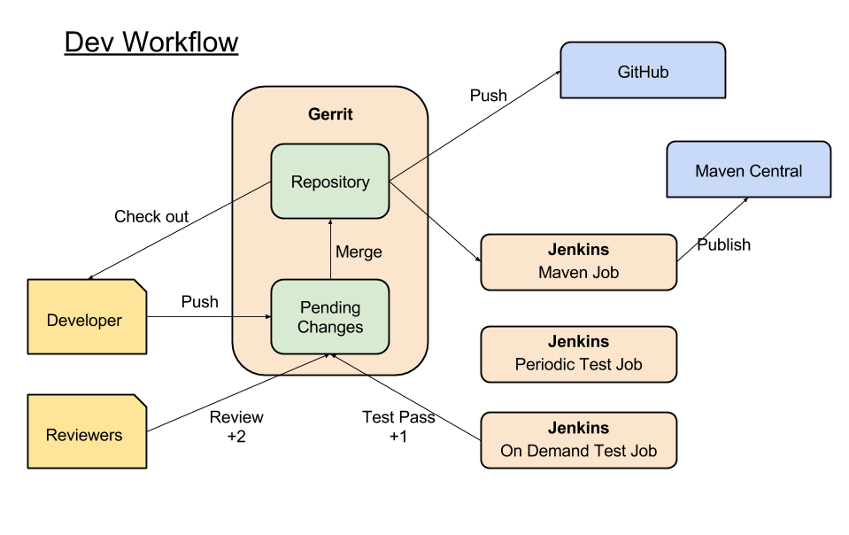

This guide describes how to set up a development environment to build the tutorials -- or to work on Xenon.
See the [Implementors Guide](Implementors-Guide) for more information on the tutorials, and working with Xenon in your application.  The [Contributing Guide](Contributing) has the up to date information on how to contribute to Xenon.

# Prerequisites

## Java

 * Java 8 JDK installed on your OS of choice (Mac OSX, Linux variants, Windows are all supported hosts)
 * [Eclipse Luna](http://eclipse.org) or a modern IDE of your choice. Make sure to apply the same formatting profile for code.
 * Git for source code management.
 * [Find bugs](http://findbugs.sourceforge.net/) for static code analysis. Please run before check-in.


## Maven

Maven is used to build and test the project. Use the Maven Wrapper (`mvnw`) which comes with project, or install maven to your local system. Reference the [maven-wrapper.properties][] file for required version.

* _(Optional)_ Install Maven with your system's package manager (e.g. _apt_ on Ubuntu/Debian, _homebrew_ on OSX, ...).
* Set your `JAVA_HOME` environment variable to be the home of the Java 8 JDK. On OSX, this lands in `/Library/Java/JavaVirtualMachines/jdk1.8.0_65.jdk/Contents/Home/`.
* Run `./mvnw test` to run the tests.
  * Run `./mvnw -Dtest={test-name} test` to run a single test (http://maven.apache.org/surefire/maven-surefire-plugin/examples/single-test.html)
* Run `./mvnw package` to build and package Xenon
* Run `./mvnw -DskipTests package` to package everything and skip running the tests. (Not recommended.)

> Tip: See which goals are bound to which phases for a particular command:
```sh
./mvnw help:describe -Dcmd=compile
```


## Docker Images

Up to date information can be found on building and using the [Xenon Docker Images here](Docker-Images)

## Packaging a fat jar

Resulting JAR goes to `xenon-host/target/xenon-host-*-with-dependencies.jar`.

* `./mvnw clean package -DskipTests` (packages without running tests)
*  To start the default service host and poke it with a HTTP client see [this debugging page section](Debugging-and-Troubleshooting#starting-a-host)

# Building a service

After reading more on the [programming model](Programming-Model) and how a service works, please refer to the [example service tutorial](Example-Service-Tutorial) to learn about a simple service that is already started as part of the production service host, and enables you to interact with the system. In addition you can follow the guide for [serving your service with a default or custom user interface](./Host-Your-UI).

To create a new service host, that starts custom services, in its own jar, please see the [custom service hosting tutorial](Hosting-Custom-Services-On-Xenon)

# Starting a Xenon host

Please refer to [Starting Xenon Host](Start-Xenon-Host) page for starting a Xenon application.

# CI / CD
(Currently this information is relevant for VMware internal development only)

Core xenon changes are validated through tests running on a jenkins instances, across several VMs. The tests run for every gerrit patch and periodically (over 1000 full tests passes a day, single node, multi node, etc).

Any failures are reported to the Pivotal Tracker xenon project.  
The job uses an API token for a specific user, and creates new items when a test fails

## Developer Workflow



We use gerrit as a review tool as well as authoritative git repository.  
Jenkins is setup to perform test(pre,post check-in), release, and publishing.  
All changes are publicly available in github.  
Released versions and snapshots are synched to maven central.


## Testing

Xenon build infrastructure is setup on jenkins and run tests at pre-check-in, post-check-in, and per developer request.


### Pre check-in

Gerrit triggers jenkins test job that runs all tests with new changeset developer submitted.
This is a requirement for the changeset to be merged into the master branch.
Successful build will post +1 on gerrit code review.

### Post check-in

Periodically, jenkins triggers test jobs to run ALL tests in the latest master.

Currently, we have following jobs:

* High frequency - run all tests every 15min on 6 jenkins nodes
* Windows machine - run all tests on windows machine
* Raspberry pie cluster - 10 node clustered physical raspberry pie machines
* Scenario based configuration - configured to run specific test with long running, pause-resume, servicehost restart, etc.


### Per developer request

Jenkins also have jobs to run tests per developer's request.  
This is mainly used for debugging issues, pre-check the impact before critical changes, etc.  
This job can be enabled/disabled per developers request.

# Debugging

Please refer to the [debugging page](Debugging-and-Troubleshooting) for information on how to effectively debug a decentralized, 100% asynchronous system like Xenon.

# Code Style
Please refer to the [Code Style page](Code-Style)

----
[maven-wrapper.properties]: https://github.com/vmware/xenon/blob/master/.mvn/wrapper/maven-wrapper.properties
