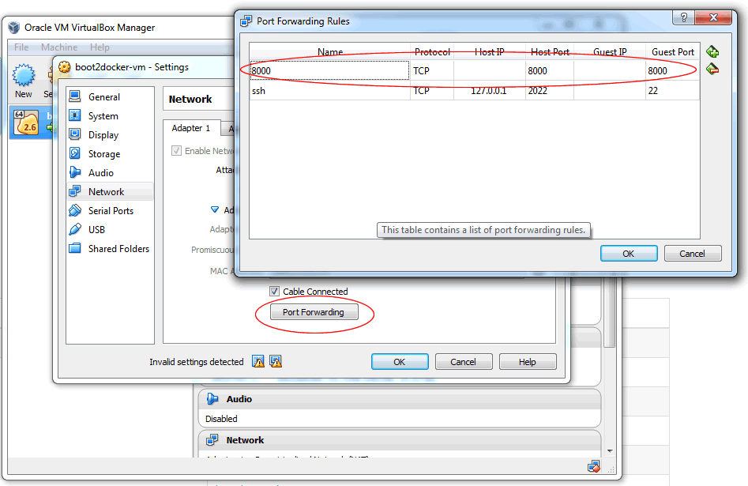

This guide  describes a few  common guidelines and  recommendations when
implementing a micro service and development in the Xenon framework (i.e.,
contributing  code).

## Under construction
The page is under construction and in the process of being updated to properly
cover open source based work flow, vs the vmware internal details still mentioned below

# Prerequisites

## Java

 * Java 8 JDK installed on your OS of choice (Mac OSX, Linux variants, Windows are all supported hosts)
 * [Eclipse Luna](http://eclipse.org) or a modern IDE of your choice. Make sure to apply the same formatting profile for code.
 * Git for source code management.
 * [Find bugs](http://findbugs.sourceforge.net/) for static code analysis. Please run before check-in.

 
## Docker images

The Xenon base image (containing a trimmed down version of the Java 8 runtime) can be built and run. This documentation will be updated soon to describe how to build the container and load it into docker.

To run the container:

```sh
docker run -t -i --net=host dcp:jenkins-4222 bin/run.sh --bindAddress=0.0.0.0
```

You can now issue requests:

```sh
$ curl -s localhost:8000/core/management | jq .codeProperties
{
  "git.commit.id.describe": "73d7cf2",
  "git.commit.id.abbrev": "73d7cf2",
  "git.commit.time": "16.03.2015 @ 19:00:18 UTC",
  "git.commit.id": "73d7cf250e95f80e2b676260ba8c0d0d53c8d459",
  "git.commit.id.describe-short": "73d7cf2"
}
```

**Note**: if you're on windows running VirtualBox you can't access localhost:8000 directly. You either need to get that VM IP (boot2docker ip) or better yet reroute 8000 to your docker container VM like this:


## Maven

Maven is used to build and test the project.

* Install Maven with your system's package manager (e.g. _apt_ on Ubuntu/Debian, _homebrew_ on OSX, ...).
* Set your `JAVA_HOME` environment variable to be the home of the Java 8 JDK. On OSX, this lands in `/Library/Java/JavaVirtualMachines/jdk1.8.0_65.jdk/Contents/Home/`.
* Run `mvn test` to run the tests.
  * Run `mvn -Dtest={test-name} test` to run a single test (http://maven.apache.org/surefire/maven-surefire-plugin/examples/single-test.html)
* Run `mvn package` to build and package Xenon
* Run `mvn -DskipTests package` to package everything and skip running the tests. (Not recommended.)

## Contributing

After you have made your changes, added the relevant test cases, and made sure they pass, it is time to commit!

Please observe the following guidelines for writing a comprehensive commit message: http://tbaggery.com/2008/04/19/a-note-about-git-commit-messages.html

See the [Gerrit workflow](Gerrit-workflow) document for a more comprehensive guide to using Git and Gerrit.

## Packaging a fat jar

Resulting JAR goes to `xenon-host/target/xenon-host-*-with-dependencies.jar`.

* `mvn clean package -DskipTests` (packages without running tests)
*  To start the default service host and poke it with a HTTP client see [this debugging page section](Debugging-and-Troubleshooting#starting-a-host)

## Maven tips

See which goals are bound to which phases for a particular command:

```sh
mvn help:describe -Dcmd=compile
```

# Debugging

Please refer to the [debugging page](Debugging-and-Troubleshooting) for information on how to effectively debug a decentralized, 100% asynchronous system like Xenon.

# Building a service

After reading more on the [programming model](Programming-Model) and how a service works, please refer to the [example service tutorial](Example-Service-Tutorial) to learn about a simple service that is already started as part of the production service host, and enables you to interact with the system. In addition you can follow the guide for [serving your service with a default or custom user interface](HostYourUi).

To create a new service host, that starts custom services, in its own jar, please see the [custom service hosting tutorial](Hosting-Custom-Services-On-Xenon)