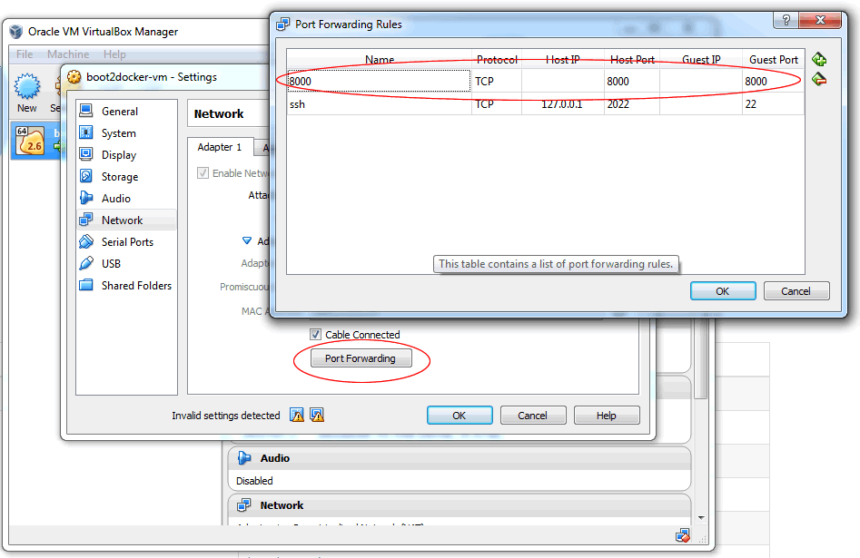

# Docker Images

The Xenon base image (containing a trimmed down version of the Java 8 runtime) can be built and run. This documentation will be updated soon to describe how to build the container and load it into docker.

To run the container:

```sh
docker run -t -i --net=host dcp:jenkins-4222 bin/run.sh --bindAddress=0.0.0.0
```

*Please refer to [Starting Xenon Host](Start-Xenon-Host) page for details on other available command line arguments.*


You can now issue requests:

```sh
$ curl -s localhost:8000/core/management | jq .codeProperties
{
  "git.commit.id.describe": "73d7cf2",
  "git.commit.id.abbrev": "73d7cf2",
  "git.commit.time": "16.03.2015 @ 19:00:18 UTC",
  "git.commit.id": "73d7cf250e95f80e2b676260ba8c0d0d53c8d459",
  "git.commit.id.describe-short": "73d7cf2"
}
```

**Note**: if you're on windows running VirtualBox you can't access localhost:8000 directly. You either need to get that VM IP (boot2docker ip) or better yet reroute 8000 to your docker container VM like this:


