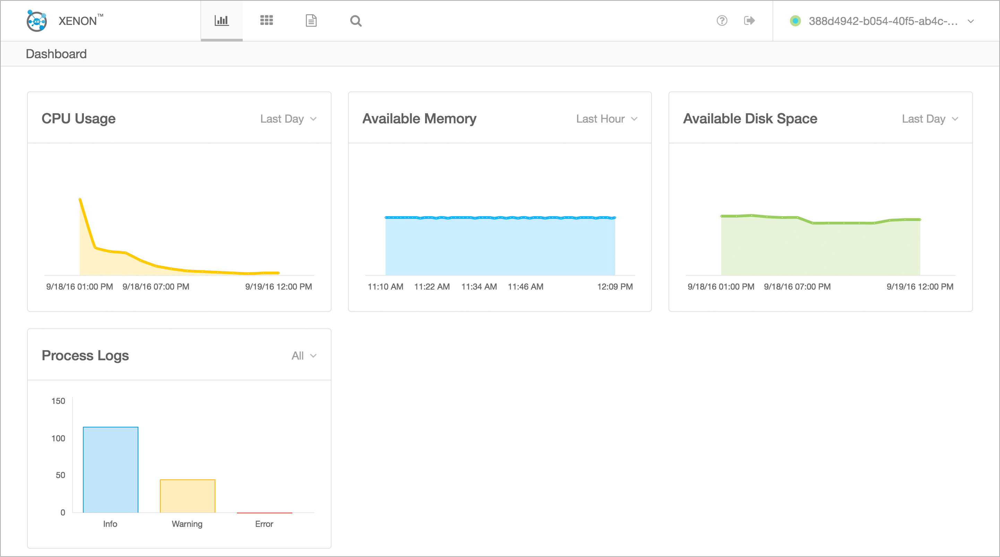

# Documentation

* [Slides](https://github.com/vmware/xenon/blob/master/contrib/docs/Xenon.pptx) - Overview presentation
* [Implementors Guide](./Implementors-Guide) - A starting point for learning about Xenon core design and implementation
* [FAQ](./FAQ) - Frequently asked questions and answers
* Slack Channel (VMware only for now) - [xenon](https://vmware.slack.com/messages/xenon/details/)
* Tutorials
  * [Example Service Tutorial](./Example-Service-Tutorial) - A simple service walk through
  * [Coordinating Async Operations](./Coordinating-Async-Operations-(and-avoiding-callback-hell))
  * [Introduction to Service Queries](./Introduction-to-Service-Queries)
  * [Query Task Service Tutorial](./QueryTaskService) - API and in-depth tutorial on query tasks
  * [Graph Query Service](./GraphQueryTaskService) - API and tutorial for graph query tasks
  * [Authentication and Authorization Tutorial](./Authentication-And-Authorization-Tutorial)
  * [Task Service Tutorial](./Task-Service-Tutorial) - Task services manage long-running tasks
  * [Hosting Modern UI Tutorial](./Host-Your-UI) - How to package HTML5/JS UI content and have xenon serve it
  * [Time Series and Event Data Tutorial](./Storing-metrics) - Best practices for storing metrics or supporting high ingestion rate for events / logs / stats
  * [Multiple Node Tutorial](./Multi-Node-Tutorial) - Simple example of on how to start N xenon hosts, have them join each other, and verify service and state replication
  * [Restartable Highly Available Task Tutorial](./Highly-Available-Task-Tutorial) - Advanced tutorial on core xenon concepts regarding high availability, consensus, restartable work flows
  * [Bootstrap Service Tutorial](./Bootstrap-Service-Tutorial) - Performing a logic only once within a cluster(node group)
  * [Testing Tutorial](./Testing-Tutorial) - How to write tests using xenon testing framework
* [Developer Guide](./Developer-Guide) - How to set up your development environment, build & run tests.
* [Testing Guide](./Testing-Guide) - How to test your highly available xenon services, all from a local machine
* [Contributing](./Contributing) - How to work with revision control and submit changes to Xenon.
* [Glossary](./Glossary) - Commonly used terms and their definitions

# Tools
* [Xenon Client](./Xenon-Client-(xenonc)) - A simple command line interface to Xenon
services.
* [Xenon UI](./Xenon-UI) - A built-in application that federates information from nodes across the node groups and visualize them in a single pane of UI.

