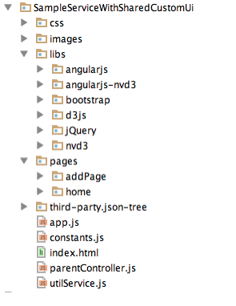
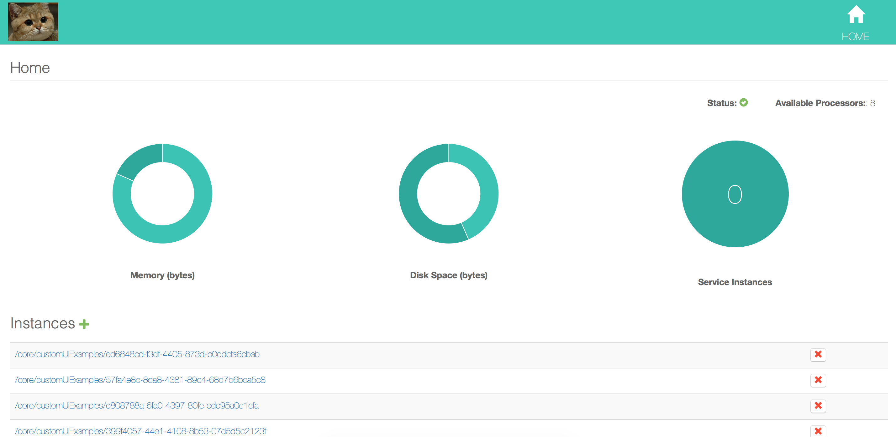

# Overview
Xenon provides built-in support for interacting with your services through user interface from your browser. You have the option to load and serve your factory and instance services through the default UI (the resources reside on the disk). To access the default UI point your browser at `localhost:8000/service-self-link/ui`. A different option is define your own custom UI by using the `HTML_USER_INTERFACE` option on the service that you want to serve with the custom resources.

The UI support is flexible enough to allow you to point any number of services to the default or the custom UI by sharing the custom endpoint.

# Host Custom UI
Depending on the complexity of the requirements, you can create a custom UI of your service using either a MVC/MVVM web application frameworks (Angular, Ember, etc.), or just a simple HTML file and a few lines of Javascript. As long as there's a index.html placed under resource/ui/your-service-package. For more details, please continue reading.

## Custom UI for a Single Microservice
Find the complete code for this tutorial in the xenon-samples of the module of xenon source. This sample is built on [Angular 1](https://angularjs.org/).

To define custom UI for a service, follow the steps below:

**Step 1**: Create a new service which will be responsible for serving the custom UI. An example would be the `SampleServiceWithSharedCustomUi` and it would look like the code below:

```java
package com.vmware.xenon.services.samples;

import com.vmware.xenon.services.common.ServiceUriPaths;
import com.vmware.xenon.services.common.UiContentService;

/**
 * Just serve the static resources at a location.
 */
public class SampleServiceWithSharedCustomUi extends UiContentService {
    public static final String SELF_LINK = "/core/ui/custom";
}
```

The UiContentService is stateless service that behaves like a regular web server serving resources from a directory.

**Step 2**: Once `SampleServiceWithSharedCustomUi` was created it needs to be started in the host:

```java
super.startService(new SampleServiceWithSharedCustomUi());
```

**Step 3**: Next, the actual UI resources need to be added. Place the UI resources under `resources/ui/service-package-name`. For the `SampleServiceWithSharedCustomUi` example this translates to `resources/ui/com/vmware/xenon/services/samples/SampleServiceWithSharedCustomUi`.
The custom UI for `SampleServiceWithSharedCustomUi` is built in AngularJS, and a typical folder structure for that would be the following:



**Step 4**: Next, for the service that will use above custom UI set the `ServiceOption.HTML_USER_INTERFACE` to `true` inside the constructor. When this option is set to true the back end expects to find the UI resources related to this service under `resources/ui/com/vmware/xenon/services/samples/SampleServiceWithCustomUi` (next step).

```java
public SampleServiceWithCustomUi() {
        super(SampleServiceWithCustomUiState.class);
        super.toggleOption(ServiceOption.PERSISTENCE, true);
        super.toggleOption(ServiceOption.REPLICATION, true);
        super.toggleOption(ServiceOption.INSTRUMENTATION, true);
        super.toggleOption(ServiceOption.OWNER_SELECTION, true);
        super.toggleOption(ServiceOption.HTML_USER_INTERFACE, true);
    }
```

**Step 5**: Every time you point your browser to `services-using-custom-ui-self-link/ui` the host looks for an `index.html` file. That index.html needs to be placed under `resource/ui/your-service-package`. Form the `SampleServiceWithCustomUi` it needs to be under `resources/ui/com/vmware/xenon/services/samples/SampleServiceWithCustomUi` and it looks like the below:

```html
<!DOCTYPE html>
<html lang="en">
<head>
    <meta charset="UTF-8">
    <meta content="utf-8" http-equiv="encoding">
</head>

<body>
<script>
    var pathname = window.location.pathname;
    // strip the /ui suffix
    pathname = pathname.substring(0, pathname.length - 3);

    // redirect to the shared ui passing the service selfLink as #
    window.location.href = window.location.origin + "/core/ui/custom/#" + pathname + "/home";
</script>
</body>
</html>
```

The index of `SampleServiceWithCustomUi` will then extract the self-link of the service from the window location and redirect to the custom UI. The URL for the custom UI would look like: `http://localhost:8000/core/ui/custom#/core/customUiExamples/home` (for factory) or `http://localhost:8000/core/ui/custom#/core/customUiExamples/3668a6c6-fa0f-49fc-8ba7-e3b1e5133a1f/home` (for an instance). In this case, the basic custom UI will look like this:



**Note:** To facilitate writing/testing your code, you can make xenon UI serve the actual resource files from disk rather than the compiled in .jar file. Any HTML/CSS/JS changes you make will be reflect in the browser on refresh. Once built you can run the sample apps like this and make live changes:

```bash
cd xenon-samples
java -jar target/xenon-samples-0.9.5-SNAPSHOT-jar-with-dependencies.jar --resourceSandbox=src/main/resources/
```

**Step 6**: Since the `SampleServiceWithCustomUi` has the `HTML_USER_INTERFACE` option on, the corresponding factory service (SampleFactoryServiceWithCustomUi) will get that option as well. As expected, a similar index.html file needs to be in place for the factory service. Under `resources/ui/com/vmware/xenon/services/samples/SampleFactoryServiceWithCustomUi` add an identical `index.html` file as in the previous step (which will again redirect to the same custom UI).

## Routing
When creating a custom user interface you would need to use different end points to serve different pages. To achieve this we are taking advantage of the AngularJs routing capabilities. In the config of the angular app that will serve the UI you can define set the different paths that you can serve using $routeProvider. The example configuration of the custom shared UI looks like:
```
'use strict';
/* App Module */
var customUiApp = angular.module('customUiApp', ['ngRoute', 'ngResource', 'nvd3', 'json-tree']);

customUiApp.config(['$routeProvider', function ($routeProvider) {
    $routeProvider.
        when("/", {
            templateUrl: CONSTANTS.UI_RESOURCES + 'pages/home/homeView.html'
        }).
        when("/:path/:serviceName/home", {
            templateUrl: CONSTANTS.UI_RESOURCES + 'pages/home/homeView.html'
        }).
        when("/:path/:serviceName/:instanceId/home", {
            templateUrl: CONSTANTS.UI_RESOURCES + 'pages/home/homeView.html'
        }).
        when("/:path/:serviceName/addService", {
            templateUrl: CONSTANTS.UI_RESOURCES + 'pages/addPage/addService.html'
        }).
        otherwise({
            redirectTo: '/'
        });

}]);
```
In more detail, if you pointed your browser to [http://localhost:8000/core/ui/custom#](http://localhost:8000/core/ui/custom#) you would be redirected to the home.html (in the first when clause above). If you wanted to add an additional service you can add a link to your html views that will take you there. The link would look like [http://localhost:8000/core/ui/custom#/core/customUiExamples/addService](http://localhost:8000/core/ui/custom#/core/customUiExamples/addService) (the fourth when clause in the above config). In similar fashion, you can extend as needed.
