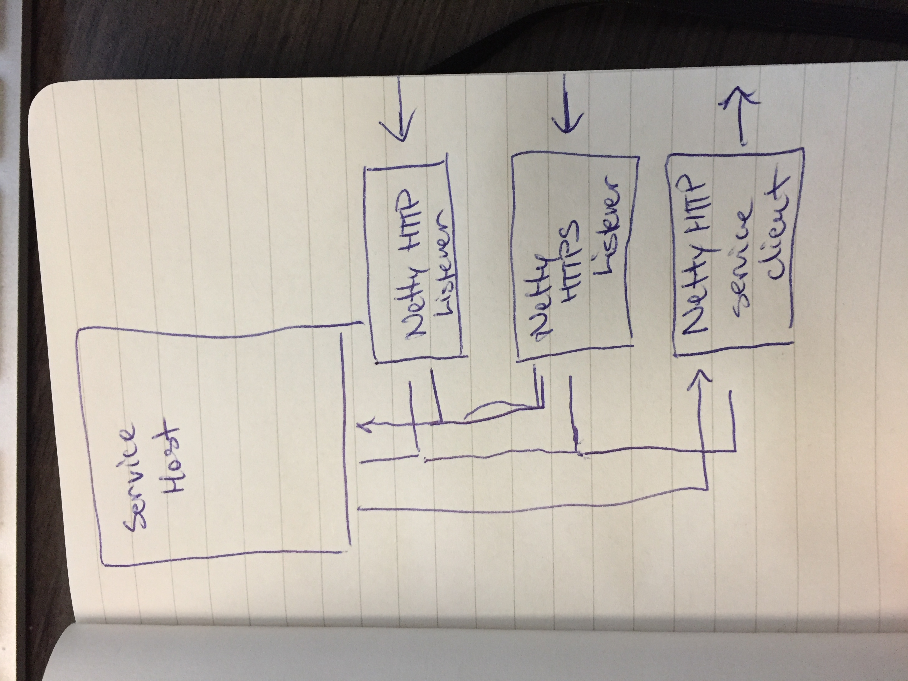
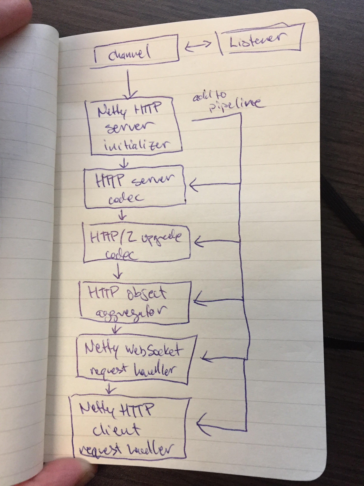
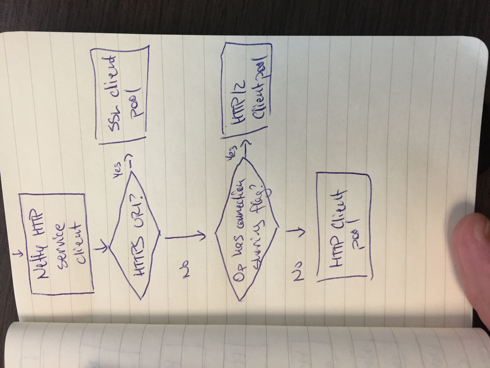
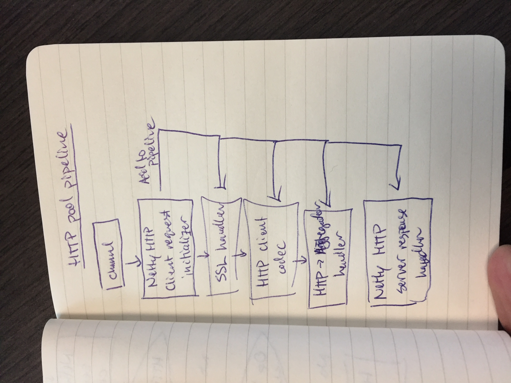
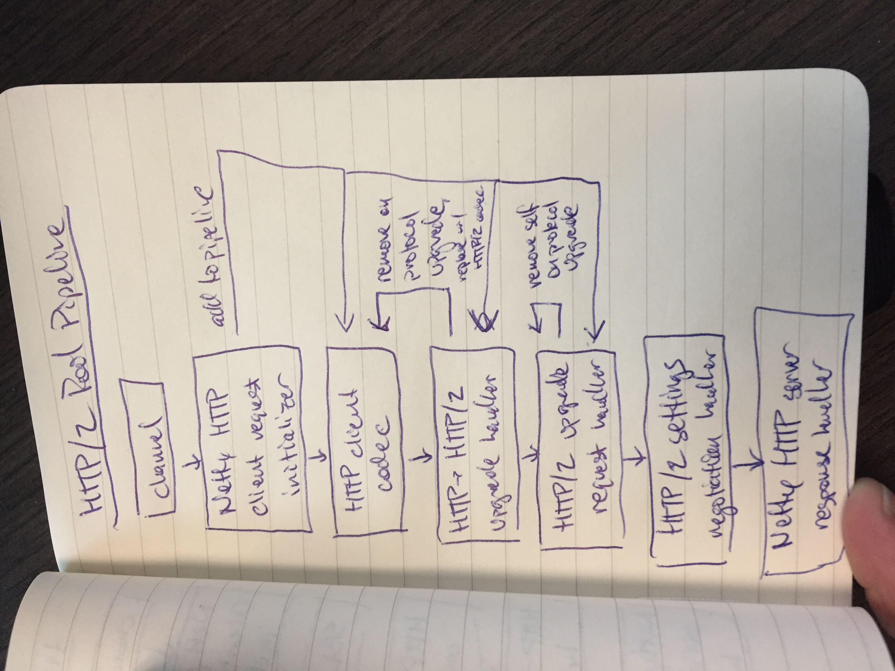

# Netty IO Pipelines

Xenon uses [Netty][netty] to implement its HTTP I/O. This document gives a high-level overview of Netty for new developers and describes how the Xenon I/O pipelines are constructed, including support for HTTP/2 and TLS.

[netty]: http://netty.io/

## Netty Overview

Netty is an asynchronous event-driven network application framework for rapid development of high-performance protocol servers and clients. It provides native support for a number of transport services and protocols, most notably WebSockets and HTTP.

At a high level, Netty works by constructing chains of handlers for events, such as the arrival of a new socket message. Individual handlers perform small, well-scoped actions such as TLS protocol negotiation, HTTP/2 protocol upgrade for the connection, HTTP/2 stream aggregation and disaggregation, and HTTP request handling. These handlers are chained together in a Netty handler pipeline to form the complete I/O pipeline.

Netty has good documentation, including a handy [user guide](http://netty.io/wiki/user-guide-for-4.x.html) which covers implementation of some basic event handlers, and [examples](http://netty.io/4.0/xref/overview-summary.html) for new developers. It's worth spending some time with the [HTTP/2 example](https://github.com/netty/netty/tree/4.1/example/src/main/java/io/netty/example/http2/helloworld) in particular to understand Xenon's usage of HTTP/2.

### HTTP/2 and TLS with Netty

Although the [HTTP/2 RFC](https://tools.ietf.org/html/rfc7540#section-3.3) does not require the use of TLS, the RFC does enforce requirements if TLS is in use. Most notably, HTTP/2 requires the use of [ALPN](https://tools.ietf.org/html/rfc7301), application-level protocol negotiation, which is not supported by the JDK even in Java 8. Netty strongly recommends the use of OpenSSL for transport security; Java libraries for ALPN support within the JVM exist, but are significantly slower and have other limitations when compared to OpenSSL.

Using OpenSSL requires that you include a version of [netty-tcnative](https://github.com/netty/netty-tcnative) in your classpath. The xenon-common submodule runs tests using the netty-tcnative-boringssl-static module for easy portability across environments and OS architectures, but Xenon will **not** pull in a netty-tcnative library in projects which consume Xenon artifacts; callers must choose and include the appropriate version of this library from the options are described on the netty-tcnative [wiki page](http://netty.io/wiki/forked-tomcat-native.html) in order to enable HTTP/2 over SSL, or else Xenon will fall back to using HTTP 1.1 for communication with secure endpoints.

For a full discussion of the issues associated with HTTP/2 over SSL, see Netty's [wiki discussion](http://netty.io/wiki/requirements-for-4.x.html#transport-security-tls) of the subject.

## Xenon's I/O Pipelines

Xenon has two major I/O pipelines to understand: input, and output. This section provides an overview of each pipeline.

Xenon service hosts receive HTTP traffic from the outside world via the [NettyHttpListener](https://github.com/vmware/xenon/blob/master/xenon-common/src/main/java/com/vmware/xenon/common/http/netty/NettyHttpListener.java). Based on user configuration, each service host will attempt to start two listeners by default on two separate ports: an unencrypted port (the HTTP listener), and an encrypted port (the HTTPS) listener. Users can also create their own additional port bindings by creating new NettyHttpListener instances before starting the service host -- for example, in scenarios where host-to-host traffic should occur on a different interface than requests from the outside world.

Xenon service hosts send HTTP traffic to the outside world using the [NettyHttpServiceClient](https://github.com/vmware/xenon/blob/master/xenon-common/src/main/java/com/vmware/xenon/common/http/netty/NettyHttpServiceClient.java). The service client performs tasks such as encoding operations for HTTP transport, and wraps one or more [NettyChannelPool](https://github.com/vmware/xenon/blob/master/xenon-common/src/main/java/com/vmware/xenon/common/http/netty/NettyChannelPool.java) structures which map to Netty outbound clients.

### Input Pipeline

When a NettyHttpListener object is started, it creates a channel listener using the user-specified child channel handler; if no channel listener is specified (the common case), then it creates a new [NettyHttpServerInitializer](https://github.com/vmware/xenon/blob/master/xenon-common/src/main/java/com/vmware/xenon/common/http/netty/NettyHttpServerInitializer.java) with which to initialize the channel.

When the channel is first used, the child handler is called to set up the processing pipeline for incoming requests. The pipeline constructed by the NettyHttpServerInitializer consists of a set of small handlers chained together in the following order:

1. If a Netty SSL context is associated with the HTTP listener, then a handler is constructed from the SSL context object and inserted into the pipeline; this handler performs the SSL handshake with the remote caller as specified by the SSL context and decrypts the encrypted payload in the message. For details, see [SslHandler](https://netty.io/4.1/api/io/netty/handler/ssl/SslHandler.html).
2. An HTTP server codec is inserted into the pipeline to decode the bytes from the payload into HTTP content objects. For details, see [HttpServerCodec](https://netty.io/4.1/api/io/netty/handler/codec/http/HttpServerCodec.html).
3. If no Netty SSL context is associated with the HTTP listener, then an HTTP-to-HTTP/2 upgrade codec is inserted into the pipeline. This handler will attempt to upgrade the connection protocol to HTTP/2 if the client supports it, and, if upgrade occurs, will insert an HTTP/2 handler into the pipeline which will demux HTTP/2 operations into their component HTTP operations and the associated HTTP/2 streams to which the writes occurred. For details, see [UpgradeCodecFactory](https://netty.io/4.1/api/io/netty/handler/codec/http/HttpServerUpgradeHandler.UpgradeCodecFactory.html) and [HttpToHttp2ConnectionHandler](https://netty.io/4.1/api/io/netty/handler/codec/http2/HttpToHttp2ConnectionHandler.html).
4. An HTTP aggregator handler is inserted into the pipeline which aggregates HTTP messages into full HTTP requests by handling chunking. For details, see [HttpObjectAggregator](https://netty.io/4.1/api/io/netty/handler/codec/http/HttpObjectAggregator.html).
5. A WebSocket request handler is inserted into the pipeline to handle WebSocket messages (which don't conform to HTTP protocol) or to handle upgrades to the WebSocket protocol.
6. A Netty HTTP client request handler is inserted into the pipeline to handle standard REST API calls to Xenon services. This handler translates HTTP operations into Xenon Operation objects which can then be dispatched to services running in the context of the local ServiceHost.

### Output Pipeline

When a NettyHttpServiceClient receives a request, it routes the request to one of its internal NettyChannelPool instances.

If all three channel pools have been created, then the service client uses the following logic to determine which pool to use:
1. If the endpoint of the operation is an HTTPS endpoint, then the sslChannelPool is used so that the traffic is sent with TLS encryption.
2. If the operation has the CONNECTION_SHARING option enabled, then the http2ChannelPool is used so that the traffic is sent over HTTP/2.
3. The default httpChannelPool is used.

Note this implies that enabling TLS disables HTTP/2 for the time being.

#### HTTP Output Pipeline

When a NettyClientPool object is started, it creates a socket channel using a new [NettyHttpClientRequestInitializer](https://github.com/vmware/xenon/blob/master/xenon-common/src/main/java/com/vmware/xenon/common/http/netty/NettyHttpClientRequestInitializer.java) with which to initialize the channel. If the user has not specified that HTTP/2 should be used on the channel, then it constructs a handler pipeline using the following handler elements:

1. If a Java SSLContext is associated with the pool, then a handler is constructed from the SSL context object and inserted into the pipeline; this handler performs the SSL handshake with the remote caller as specified by the SSL context and decrypts the encrypted payload in the message. For details, see [SslHandler](https://netty.io/4.1/api/io/netty/handler/ssl/SslHandler.html).
2. An HTTP client codec is inserted into the pipeline to decode the bytes from the payload into HTTP content objects. For details, see [HttpClientCodec](https://netty.io/4.1/api/io/netty/handler/codec/http/HttpClientCodec.html).
3. An HTTP aggregator handler is inserted into the pipeline which aggregates HTTP messages into full HTTP requests by handling chunking. For details, see [HttpObjectAggregator](https://netty.io/4.1/api/io/netty/handler/codec/http/HttpObjectAggregator.html).
4. A Netty HTTP server response handler is inserted into the pipeline to handle HTTP responses and translate them into actions within the local ServiceHost, such as completing Operation objects and calling completions.

#### HTTP/2 Output Pipeline

When a NettyClientPool object is started, it creates a socket channel using a new [NettyHttpClientRequestInitializer](https://github.com/vmware/xenon/blob/master/xenon-common/src/main/java/com/vmware/xenon/common/http/netty/NettyHttpClientRequestInitializer.java) with which to initialize the channel. If the user has specified that HTTP/2 should be used on the channel, then it constructs a handler pipeline using the following handler elements:

1. An HTTP client codec is inserted into the pipeline to decode the bytes from the payload into HTTP content objects. For details, see [HttpClientCodec](https://netty.io/4.1/api/io/netty/handler/codec/http/HttpClientCodec.html).
2. An HTTP client upgrade handler is inserted into the pipeline to attempt upgrade of the connection protocol to HTTP/2. If the upgrade is successful, then an HTTP-to-HTTP/2 handler is inserted into the pipeline to transform HTTP content into HTTP/2 message frames. For details, see [HttpToHttp2ConnectionHandler](https://netty.io/4.1/api/io/netty/handler/codec/http2/HttpToHttp2ConnectionHandler.html), [Http2ClientUpgradeCodec](https://netty.io/4.1/api/io/netty/handler/codec/http2/Http2ClientUpgradeCodec.html), and [HttpClientUpgradeHandler](https://netty.io/4.1/api/io/netty/handler/codec/http/HttpClientUpgradeHandler.html). Note Xenon uses a custom wrapper around HttpToHttp2ConnectionHandler so that individual operations can be associated with specific HTTP/2 channels. 
3. An HTTP ugprade request handler is inserted into the pipeline to trigger an HTTP action (a GET on "/") which will invoke the upgrade of the connection from HTTP to HTTP/2. Once this handler has been invoked, it will remove itself from the pipeline.
4. An HTTP/2 settings handler is inserted into the pipeline. Its purpose is to wait for the negotiation of HTTP/2 settings to complete, and to notify the system that the negotiation has completed so that user data can be sent on the channel.
5. A Netty HTTP server response handler is inserted into the pipeline to handle HTTP responses and translate them into actions within the local ServiceHost, such as completing Operation objects and calling completions.
