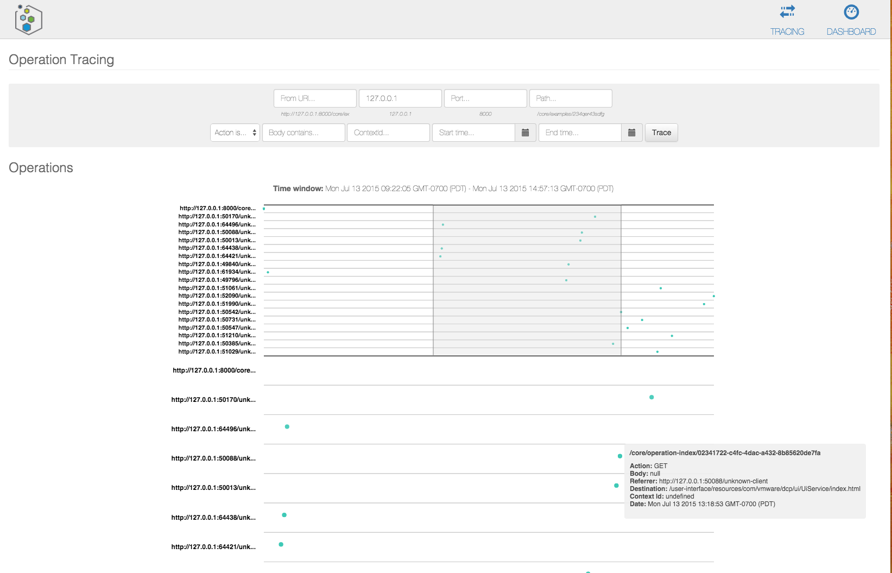

# Operation Tracing

[Services](./Programming-Model) in Xenon use a [REST API](./REST-API) with asynchronous operations to interact with one another.  To aid in debugging, the Operation Tracing Index Service can be used to index each operation sent or received by a service host instance (also referred to as a node).  

For example if a service sends an operation to another service, both the client-side operation sent and the server-side operation received by the destination service will be persisted and indexed in the Operation Tracing index.

The Operation Index, like the Service Document Index used to store service state in Xenon, is backed by a Lucene document store.  The same [query service](./QueryTaskService.markdown) and query task semantics can be used to query all of the operations passed into and out of the system.

##  Starting and stopping the Operation Tracing Service

There is a performance penalty to persisting and indexing each operation passed in the system.  As such, by default the operation tracing service is disabled.  To enable it, `PATCH` an `OperationTracingEnable` request to the `ServiceHostManagementService`.

```
PATCH /core/management HTTP/1.1
{
  "enable": "START",
  "documentKind": "com:vmware:dcp:services:common:ServiceHostManagementService:ConfigureOperationTracingRequest"
}
```

Here is a curl example:
```
curl --request PATCH -H "Content-type: application/json" --data '{"enable": "START","documentKind": "com:vmware:dcp:services:common:ServiceHostManagementService:ConfigureOperationTracingRequest"}' http://127.0.0.1:8000/core/management
```
Likewise, setting `enable` to `STOP` will disable the service.

Starting the service will create a separate Lucene backed index in `dcp/8000/lucene-operation-index`.  Each operation sent via `sendRequest` or received via `handleRequest` will be indexed to the operation index.  This includes all parameters set in the operation and the body.  This should capture all(*) operations sent/received between Xenon services, external services, and users.

**NOTE** - You should stop the operation index on all nodes after the debugging sessions is complete. Otherwise, due to periodic operations, it will use up disk space.

(\*) - We maintain a blacklist of chatty services which will *not* be persisted and indexed in order to save some disk space and indexing time.  Some Xenon services are very chatty by nature and are of marginal importance when debugging a standard Stateful or Stateless service.  This list currently includes all of the node group services, the UI service, and the document index service.  We'll make this list configurable in the future to add/remove services to ignore.
  
## Example Query

The following query will query the Operation Index (specified by the `indexLink`) for all operations POSTed to `resources/*` from a specific resource allocation task (specified by the `referer` parameter).  The results will include all resources created by the allocation task (computes, disks, etc).  The query itself is posted to the same `core/query-tasks` factory used to query service documents.

```json
{
  "querySpec": {
    "query": {
      "booleanClauses": [
        {
          "occurance": "MUST_OCCUR",
          "term": {
            "propertyName": "referer",
            "matchValue": "*/provisioning/resource-allocation-tasks/jenkins-7f9c7c7d-6490-49c0-9ac6-0f3bcef6cb1c",
            "matchType": "WILDCARD"
          }
        },
        {
          "occurance": "MUST_OCCUR",
          "term": {
            "propertyName": "action",
            "matchValue": "POST",
            "matchType": "TERM"
          }
        },
        {
          "occurance": "MUST_OCCUR",
          "term": {
            "propertyName": "path",
            "matchValue": "/resources/*",
            "matchType": "WILDCARD"
          }
        }
      ]
    },
    "options": [
      "EXPAND_CONTENT"
    ]
  },
  "indexLink": "/core/operation-index"
}
```

The query returns the following
```json
   "results": {
    "documentLinks": [
      "/core/operation-index/e5ff1907-982b-4d7c-908d-79349d41c265",
      "/core/operation-index/d4f36d0c-6d2e-4ae3-b1d4-fe9f4a221ffa",
      "/core/operation-index/0c78bcd9-7feb-47e7-a6d8-b10e55aced65",
      "/core/operation-index/1954e4ec-a3e2-4073-ab6d-d58a6f183b38",
      "/core/operation-index/6b3cbb66-8190-481c-b717-5864e6b0d6ae",
     ...
    ],
    "documents": {
      "/core/operation-index/ddd3c3cf-8c74-4e4d-9480-faa7d3cfce84": {
        "action": "POST",
        "host": "127.0.0.1",
        "port": 8000,
        "path": "/resources/disks",
        "id": 2549,
        "referer": "http://192.168.13.97:8000/provisioning/resource-allocation-tasks/jenkins-7f9c7c7d-6490-49c0-9ac6-0f3bcef6cb1c",
        "jsonBody": "{\"id\":\"f0615f1a-1e28-46b4-a718-212b37ff2df0\",\"sourceImageReference\":\"https://www.googleapis.com/compute/v1/projects/debian-cloud/global/images/debian-7-wheezy-v20140606\",\"type\":\"NETWORK\",\"name\":\"boot-image\",\"status\":\"DETACHED\",\"capacityMBytes\":0,\"bootOrder\":1,\"documentVersion\":0,\"documentEpoch\":0,\"documentKind\":\"com:vmware:pinada:provisioning:services:DiskService:DiskState\",\"documentSelfLink\":\"/resources/disks/ccb397b5-8027-4ffa-8252-426f2304c881\",\"documentSignature\":\"58c663dee84bbf674b0fc3902cba8c1d3af68737\",\"documentUpdateTimeMicros\":1436896893130000,\"documentExpirationTimeMicros\":0,\"documentOwner\":\"1f59ed68-8ec5-4cf2-bc76-a162fcb265bd\"}",
        "statusCode": 0,
        "options": [
          "REPLICATED_TARGET"
        ],
        "documentVersion": 0,
        "documentKind": "com:vmware:dcp:common:Operation:SerializedOperation",
        "documentSelfLink": "/core/operation-index/ddd3c3cf-8c74-4e4d-9480-faa7d3cfce84",
        "documentSignature": "6a13450d6ea7ef314e3e404858f95ad4b9888a16",
        "documentUpdateTimeMicros": 1436896894982006,
        "documentExpirationTimeMicros": 1436983294982005
      },
      "/core/operation-index/127b1ba3-8838-48aa-bd5e-40cd80015b4c": {
        "action": "POST",
        "host": "127.0.0.1",
        "port": 8000,
        "path": "/resources/compute",
        "id": 2679,
        "referer": "http://192.168.13.97:8000/provisioning/resource-allocation-tasks/jenkins-7f9c7c7d-6490-49c0-9ac6-0f3bcef6cb1c",
        "jsonBody": "{\"id\":\"jenkins-7f9c7c7d-6490-49c0-9ac6-0f3bcef6cb1c-1\",\"descriptionLink\":\"/resources/compute-descriptions/n1-standard-1\",\"resourcePoolLink\":\"/resources/pools/62560804-e248-46f3-bd8b-9820e6cd6ed5\",\"powerState\":\"UNKNOWN\",\"parentLink\":\"/resources/compute/gce-parent-sage-surfer-749\",\"diskLinks\":[\"/resources/disks/533429dd-e4fe-4942-bb3e-fb3554de97d6\"],\"networkLinks\":[],\"documentVersion\":0,\"documentUpdateTimeMicros\":0,\"documentExpirationTimeMicros\":0}",
        "statusCode": 0,
        "options": [
          "REPLICATED_TARGET"
        ],
        "documentVersion": 0,
        "documentKind": "com:vmware:dcp:common:Operation:SerializedOperation",
        "documentSelfLink": "/core/operation-index/127b1ba3-8838-48aa-bd5e-40cd80015b4c",
        "documentSignature": "1d1a0f9cd22044f293a633edadeb34b768a942f5",
        "documentUpdateTimeMicros": 1436896895157001,
        "documentExpirationTimeMicros": 1436983295157000
      },
      "/core/operation-index/38937098-9081-44e4-b380-80fa7d9cb45c": {
        "action": "POST",
        "host": "127.0.0.1",
        "port": 8000,
        "path": "/resources/compute",
        "id": 2715,
        "referer": "http://192.168.13.97:8000/provisioning/resource-allocation-tasks/jenkins-7f9c7c7d-6490-49c0-9ac6-0f3bcef6cb1c",
        "jsonBody": ...,
        "statusCode": 0,
        "options": [
          "REPLICATED_TARGET"
        ],
...
        "documentSelfLink": "/core/operation-index/38937098-9081-44e4-b380-80fa7d9cb45c",
...
      },
      "/core/operation-index/072dd89b-d680-4aad-a113-9c7f8c4dae85": {
        "action": "POST",
        "host": "127.0.0.1",
        "port": 8000,
        "path": "/resources/disks",
        "id": 2581,
        "referer": "http://192.168.13.97:8000/provisioning/resource-allocation-tasks/jenkins-7f9c7c7d-6490-49c0-9ac6-0f3bcef6cb1c",
...
        "documentSelfLink": "/core/operation-index/072dd89b-d680-4aad-a113-9c7f8c4dae85",
...
      },
      "/core/operation-index/09813d33-930e-421f-8a84-a4b8619a69d1": {
        "action": "POST",
        "host": "127.0.0.1",
        "port": 8000,
        "path": "/resources/compute",
        "id": 2608,
        "referer": "http://192.168.13.97:8000/provisioning/resource-allocation-tasks/jenkins-7f9c7c7d-6490-49c0-9ac6-0f3bcef6cb1c",
...
        "documentSelfLink": "/core/operation-index/09813d33-930e-421f-8a84-a4b8619a69d1",
...
      },
...
  },
  "indexLink": "/core/operation-index",
  "documentVersion": 0,
  "documentEpoch": 0,
  "documentKind": "com:vmware:dcp:services:common:QueryTask",
  "documentSelfLink": "/core/query-tasks/6c2eddb1-e392-40ba-aeeb-637f7bfe3660",
  "documentUpdateTimeMicros": 1436898841921000,
  "documentExpirationTimeMicros": 1436899441921003,
  "documentOwner": "cb5238c2-0cc6-454a-849d-8b4e2609bdd2"
}
...
```

Only `SerializedOperation`s are persisted in the Operation Index.  The query `propertyNames` can, therefore, only be fields present in the [serialized operation](https://github.com/vmware/xenon/blob/master/dcp-common/src/main/java/com/vmware/dcp/common/Operation.java#L63).  Refer to the [query service](./QueryTaskService.markdown) for further details on querying.

**NOTE** - You must specify the correct `indexLink` to query the operation index (`/core/opreation-index`).  By default, queries will be executed on the document index unless this field is specified.

## Operation Tracing UI

Similarly, the operations can be traced from the default UI by visiting http://127.0.0.1:8000/core/ui/default#/core/operationIndex. The query results are visualized in a swim-lane chart. Selecting an area in the top part of the swim-lane chart will displayed a zoomed version in the bottom part of the chart. Additionally, placing your mouse over on the operations mapped on the bottom part of the chart will provide additional information for each indexed operation.




