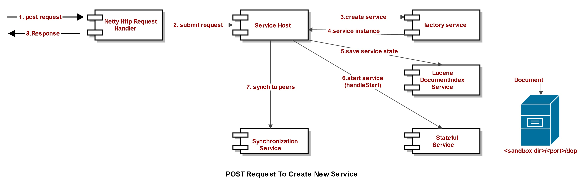
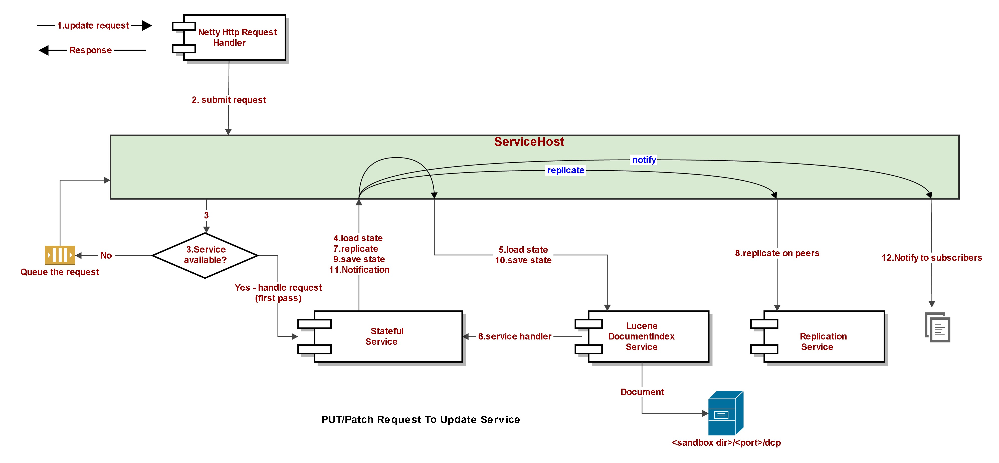

# Programming Model

The following types are the key components of the Xenon framework. Xenon is implemented primarily in Java, but a minimal and useful implementation of the service programming model is also available in Go, running in the go-dcp-* process.

 * ServiceHost - Manages the life cycle of micro service instances and is the unit of a Xenon node. Multiple hosts can co-exist within a process although production management hosts should be one per process, and one process per container. A host uses a ServiceRequestListener to receive inbound operations from the network
 * Service - The interface for a service implementation
 * StatefulService - The Java base class that handles most of the service workflow, allowing derived classes to simply override a few handlers and implement their specific validation and/or orchestration. This is the super class recommended for all service implementations
 * FactoryService - The stateless java base class that handles POST requests to create new services. It also handles GET, which is translated to a documentSelfLink prefix query, and returns all available children services
 * Operation - The container for a request / response message pattern. A service acting as a client to other services creates an operation, sets the URI, action (HTTP verb), body plus other fields, then uses the service client to send the request. A service handler is invoked when inbound operations are received from the network or other co-located services.
 * ServiceClient - The asynchronous client interface
 * HttpServiceClient - The implementation of ServiceClient for talking to other HTTP Xenon services or HTTP endpoints. The caller constructs an Operation instance, using a builder pattern, and calls send() on the client
 
## Design patterns

The [design patterns](./service-design-patterns) page offers some tips on how to think about Xenon services and how to model various documents, workflows. It might be worth reading before diving into details 

## Xenon Operation processing

### Service Creation (POST to Factory Service)


### Update handling (PUT,PATCH, DELETE to a StatefulService)




## Service Interface
 The snippet below contains the key methods relevant to developers. For a complete list please refer to Service.java
(/dcp-common/src/main/java/com/vmware/dcp/common/Service.java)

```Java
public interface Service {
     enum Action {
        GET, POST, PATCH, PUT, DELETE
    }

    /**
     * Service options. Service author toggles various options in the service constructor declaring
     * the requirements to the framework
     */
    enum ServiceOption {
        /**
         * Service runtime tracks statistics on operation completion and allows service instance and
         * external clients to track custom statistics, per instance. Statistics are available
         * through the /stats URI suffix, and served by an utility services associated with each
         * service instance. Statistics are not replicated but can be gathered across all instances
         * using broadcast GET requests.
         */
        INSTRUMENTATION,

        /**
         * Service runtime periodically invokes the handleMaintenance() handler making sure only one
         * maintenance operation is pending per service instance. If a maintenance operation is not
         * complete by the next maintenance interval a warning is logged.
         */
        PERIODIC_MAINTENANCE,

        /**
         * Service runtime forwards the update state to the local document index service state. The
         * document index independently tracks multiple versions of the service state and indexes
         * fields using indexing options specified in the service document template (see
         * {@code getDocumentTemplate}
         */
        PERSISTENCE,

        /**
         * Service state updates are replicated among peer instances on other nodes. The default
         * replication group is used if no group is specified. Updates are replicated into phases
         * and use the appropriate protocol depending on other options.  See
         * OWNER_SELECTION and EAGER_CONSISTENCY options on how they affect replication.
         *
         */
        REPLICATION,

        /**
         * Service runtime performs a node selection process, per service, and forwards all updates
         * to the service instance on the selected node. Ownership is tracked in the indexed state
         * versions and remains fixed as long as the current owner is healthy. To enable scale out
         * only the service instance on the owner node performs work. All instances will receive the
         * updated state but the service handler is only invoked on the instance in the owner node.
         * This option causes replication to happen after the owner service has validated the update
         * and waits for quorum number of peers to accept the replicated state, before completing
         * the operation to the client. If less than quorum peers accept the update, the owner will
         * still proceed with committing the update and completion the operation successfully. To
         * enforce strict quorum and avoid value divergence see the {@code EAGER_CONSISTENCY}
         * option
         *
         * Requires: REPLICATION Not compatible with: CONCURRENT_UPDATE_HANDLING
         */
        OWNER_SELECTION,

        /**
         * Modifies the replication protocol in a single way: Updates are committed on the owner, and
         * the client sees success on the operation only if quorum number of peers accept the updated
         * state. If the node group has been partitioned or multiple peers have failed, this option
         * makes the service unavailable, since no updates will be accepted.
         *
         * Requires: REPLICATION, OWNER_SELECTION Not compatible with: CONCURRENT_UPDATE_HANDLING
         */
        EAGER_CONSISTENCY,

        /**
         * Document update operations are conditional: the client must provide the expected
         * signature and/or version.
         *
         * If the service is durable and a signature is available in the current state, then the
         * request body must match the signature. The version is ignored.
         *
         * If there is no signature in the current state, then the version from the current state
         * must match the version in the request body.
         *
         * Requires: REPLICATION Not compatible with: CONCURRENT_UPDATE_HANDLING
         */
        STRICT_UPDATE_CHECKING,

        /**
         * Service runtime provides a HTML interactive UI through custom resource files associated
         * with the service class. The runtime serves the resource files from disk in response to
         * request to the /ui URI suffix
         */
        HTML_USER_INTERFACE,

        /**
         * Advanced option, not recommended.
         *
         * Service runtime disables local concurrency management and allows multiple update to be
         * processed concurrently. This should be used with great care since it does not compose
         * with most other options and can lead to inconsistent state updates. The default service
         * behavior serializes updates so only one update operation is logically pending. Service
         * handlers can issue asynchronous operation and exit immediately but the service runtime
         * still keeps other updates queued, until the operation is completed. GET operations are
         * allowed to execute concurrently with updates, using the latest committed version of the
         * service state
         *
         * Not compatible with: STRICT_UPDATE_CHECKING, PERSISTENCE, REPLICATION, EAGER_CONSISTENCY
         */
        CONCURRENT_UPDATE_HANDLING,

        /**
         * Service factory will convert a POST to a PUT if a child service is already present, and
         * forward it to the service. The service must handle PUT requests and should perform
         * validation on the request body. The child service can enable STRICT_UPDATE_CHECKING to
         * prevent POSTs from modifying state unless the version and signature match
         */
        IDEMPOTENT_POST,

        /**
         * Set by runtime. Service is associated with another service providing functionality for
         * one of the utility REST APIs.
         */
        UTILITY,

        /**
         * Set by runtime. Service creates new instances of services through POST and uses queries
         * to return the active child services, on GET.
         */
        FACTORY,

        /**
         * Set by runtime. Service was created through a factory
         */
        FACTORY_ITEM,

        /**
         * Set by runtime. Service is currently assigned ownership of the replicated document. Any
         * work initiated through an update should only happen on this instance
         */
        DOCUMENT_OWNER,

        NONE
    }

    enum ProcessingStage {
        /**
         * Service object is instantiated. This is the initial stage
         */
        CREATED,

        /**
         * Service is attached to service host
         */
        INITIALIZING,

        /**
         * If the service is durable, and state was available in the document store, it has been
         * loaded and made available in the initial post
         */
        LOADING_INITIAL_STATE,

        /**
         * State has been assigned a node owner id
         */
        OWNER_SELECTION,

        /**
         * Synchronizing with peers
         */
        SYNCHRONIZING,

        /**
         * Service is visible to other services (its URI is registered) and can process self
         * issued-operations and durable store has its state available for access. Operations issued
         * by other services or clients are queued
         */
        EXECUTING_START_HANDLER,

        /**
         * Initial state has been indexed
         */
        INDEXING_INITIAL_STATE,

        /**
         * Service is ready for operation processing. Any operations received while in the STARTED
         * or INITIALIZED stage will be dequeued.
         */
        AVAILABLE,

        /**
         * Service is paused due to memory pressure. Its detached from the service host and its
         * runtime context is persisted to disk.
         */
        PAUSED,

        /**
         * Service is stopped and its resources have been released
         */
        STOPPED,

    }

    String STAT_NAME_REQUEST_COUNT = "requestCount";
    String STAT_NAME_PRE_AVAILABLE_OP_COUNT = "preAvailableReceivedOperationCount";
    String STAT_NAME_FAILURE_COUNT = "failureCount";

    String STAT_NAME_REQUEST_OUT_OF_ORDER_COUNT = "requestOutOfOrderCount";
    String STAT_NAME_STATE_PERSIST_LATENCY = "statePersistLatencyMicros";
    String STAT_NAME_OPERATION_QUEUEING_LATENCY = "operationQueueingLatencyMicros";
    String STAT_NAME_SERVICE_HANDLER_LATENCY = "operationHandlerProcessingLatencyMicros";
    String STAT_NAME_OPERATION_DURATION = "operationDuration";
    String STAT_NAME_MAINTENANCE_COUNT = "maintenanceCount";
    String STAT_NAME_MAINTENANCE_COMPLETION_DELAYED_COUNT = "maintenanceCompletionDelayedCount";
    String STAT_NAME_CACHE_MISS_COUNT = "stateCacheMissCount";
    String STAT_NAME_CACHE_CLEAR_COUNT = "stateCacheClearCount";
    String STAT_NAME_VERSION_CONFLICT_COUNT = "stateVersionConflictCount";
    String STAT_NAME_VERSION_IN_CONFLICT = "stateVersionInConflict";
    String STAT_NAME_PAUSE_COUNT = "pauseCount";
    String STAT_NAME_RESUME_COUNT = "resumeCount";

    /**
     * Estimate on run time context cost in bytes, per service instance. Services should not use instanced
     * fields, so, other than queuing context and utility service usage, the memory overhead should be small
     */
    int MAX_SERIALIZED_SIZE_BYTES = 8192;

    void handleStart(Operation startPost);

    /**
     * Infrastructure use. Invoked by host to determine if a request can be scheduled for processing
     * immediately, or if it was queued by the service.
     *
     * @return True if the request was queued or false if the request should be scheduled for
     *         processing immediately
     */
    boolean queueRequest(Operation op);

    /**
     * Infrastructure use. Invoked by host to retrieve a pending request.
     */
    Operation dequeueRequest();

    /**
     * Infrastructure use. Invoked by host to execute a service handler for a request
     */
    void handleRequest(Operation op);

    /**
     * Sends a request using the default service client associated with the host
     */
    void sendRequest(Operation op);

    /**
     * Invoked by the utility service for requests to the service /config suffix
     */
    void handleConfigurationRequest(Operation request);

    /**
     * Invoked by the host periodically, if ServiceOption.PERIODIC_MAINTENANCE is set.
     *
     * An implementation of this method that needs to interact with the state of this service must
     * do so as if it were a client of this service. That is: the state of the service should be
     * retrieved by requesting a GET; and the state of the service should be mutated by submitting a
     * PATCH, PUT or DELETE.
     */
    void handleMaintenance(Operation post);

    void setMaintenanceIntervalMicros(long micros);

    long getMaintenanceIntervalMicros();

    ServiceHost getHost();

    String getSelfLink();

    URI getUri();

    RequestRouter getRequestRouter();

    ProcessingStage getProcessingStage();

    EnumSet<ServiceOption> getOptions();

    boolean hasOption(ServiceOption option);

    void toggleOption(ServiceOption option, boolean enable);

    /**
     * Sets the URI path to a node selector instance. A node selector service is associated with a node
     * group and picks the nodes eligible for replicating updates.
     *
     * The default node selector services uses a consistent hashing scheme and
     * picks among all available nodes.
     */
    void setPeerNodeSelectorPath(String link);

    /**
     * If replication is enabled, returns the URI path for the replication selector associated with the service
     */
    String getPeerNodeSelectorPath();

    ServiceStat getStat(String name);

    void adjustStat(String name, double delta);

    void adjustStat(ServiceStat stat, double delta);

    void setStat(String name, double newValue);

    void setStat(ServiceStat stat, double newValue);

    void setHost(ServiceHost serviceHost);

    void setSelfLink(String path);

    void setRequestRouter(RequestRouter router);

    void setProcessingStage(ProcessingStage initialized);

    ServiceDocument setInitialState(String jsonState, Long initialVersion);

    void setState(Operation op, ServiceDocument newState);

    <T extends ServiceDocument> T getState(Operation op);

    Service getUtilityService(String uriPath);

    Class<? extends ServiceDocument> getStateType();

    ServiceDocument getDocumentTemplate();

}
   
```      

## Service Creation

A service instance is created by issuing a POST to a factory service. Factory services should be started during service host start and are considered singletons. A factory service will create a new "child" service instance and ask the service host to start it. 

### Factory Service Handlers

Factory services are stateless so authors should keep them as simple as possible and defer initial state validation to the child service. The child service can do initial state validation in handleStart(). If the child service models a task, it should do validation as part of its task state machine. The handleStart() method should simple, initial state validation only (see the design patterns page) 


## Service Handlers
The main customization point is the service handler. That is where specific validation or orchestration logic lives. A service must override handlers for state update operations or to kick off any work. It does not need to implement a GET handler, or handlers for its utility functions (subcriptions, stats, template).

All updates are through HTTP methods and execute in arbitrary thread context. A HTTP GET provides the document representation, with the default being JSON serialization of the service state. The default GET response is implemented by the base service class (`StatefulService` in Java).

The runtime invokes a method handler (handleGet, handlePost, etc) passing it a Operation instance. The handler must be 100% asynchronous: no blocking I/O is allowed since the runtime uses just a few threads per core to schedule handlers across all components.

When a handler is finished processing a inbound request, it calls operation.complete() or operation.fail(), from any thread context. Before doing so, if a response body is expected, it must call operation.setBody().

The framework makes the handler a completely stateless method: It passes the operation (which contains the request body) and associated with it, the authoritative, latest state. The state is cloned before its passed to the handler, and its cloned again after the operation is complete (in any thread context, not just when the handler method returns)

### Request processing stages
1. If the current state is not cached, it will asynchronously load the latest state (the one with the highest update time and version) and associate it with the inbound operation. The service author can access the state using *operation.getLinkedState()*
2. The body is automatically converted to an in memory instance, using *operation.getBody(type)*
3. When the service author calls *operation.complete()* the framework will
   1. Update the state version atomically
   1. Update the update time
   1. Make sure key fields like self link and kind are set in the linked state
   1. If the service is replicated, the consensus and replication protocol will be invoked 
   1. If the service is indexed or durable, it will send the state to the document store for indexing and durability
   1. If there are any subscribers, it will issue the request, with the same body, to all subscribers
 
### Request Body Routing

Xenon can route to handler methods based on the action and the request body, if a request router is configured and set. See the [request routing](./custom-request-routing) for more details.

### Concurrency control
A Xenon service author should never have to:
1) Use locks or synchronization primitives. Since the latest state is cloned, and associated with each request, no side effects are visible between handlers. Further, the default behavior is to only have a single update active, for a specific service instance. A queue is used to serialized updates. GET requests are processed in parallel with update
2) Keep in memory fields. The service class should have no mutable fields that affect behavior. Services can migrate between handler invocations, be restarted, etc so all state should be in the service document associated with the service.

### Self update
It is very important to keep a symmetric model when it comes to state updates: Just like an external client has to issue a PATCH/POST/PUT to update state and initiate some work flow, so does any internal code. The developer of a service should just create an operation, and post it to its service URI. This makes all transitions traceable, observable and deals with nasty concurrency problems since the runtime will take care of queueing and synchronization.

### State update hints
If a service notices that an update operation does not provide new content, it can communicate to the framework to *not* update the current version and index a new state version. To do so it must do the following:

```
    operation
        .setStatusCode(Operation.STATUS_CODE_NOT_MODIFIED)
        .setBody(null);
```

The following handler implements PATCH and updates its current state using the body in the request. However, if it does not notice a difference between current and the patch, it set the STATUS_CODE_NOT_MODIFIED in the operation

```
    
    public void handlePatch(Operation patch) {   
        NodeState currentState = getState(patch);
        NodeState body = patch.getBody(NodeState.class);
        
        if (body.status != null) {
            if (body.status == currentState.status) {
                isNew = false;
            }
            currentState.status = body.status;
        }
        if (!isNew) {
            // Optimization: prevent a new version from getting indexed.
            patch.setStatusCode(Operation.STATUS_CODE_NOT_MODIFIED);
            currentState = null;
        }
        patch.setBody(currentState).complete();
    }
```

## Periodic maintenance

Services can opt in to receive periodic messages, in their **handleMaintenance** handler, so they can execute grooming, health and other periodic tasks. See ServiceOption.PERIODIC_MAINTENANCE. This option combines with ServiceOption.OWNER_SELECTION so only service instance designated as owners execute the potentially resource consuming tasks, allowing load balancing out among peers.

If an implementation of the **handleMaintence** method needs to interact with the state of its service, it must do so as if it were a client to that service.

i.e. 

* The state must be retrieved by requesting a `GET`.
* The state must be mutated by submitting a `PUT` or `PATCH`.

## Verb semantics and associated actions

* POST (collection) - If done on a collection, creates a new service instance, with the POST body being the initial service state. If service is durable, state is loaded automatically from the store/index. Its strongly recommended to avoid "sub collections" within a service document. A collection item should be a service
* POST - If done on a stateless service, it can be used to compute work, or to add new resources on the service. 
* DELETE - The service will be stopped. A persisted service will receive a new "empty" state version, with just the common fields. This will mark the self link associated with the service as "deleted". No state versions are actually deleted, the store will just fail GET requests for self links marked "deleted". Client can still request specific versions. A grooming cycle on the store can remove versions outside version retention limit for the service
* PATCH - Used to update one or more fields in the document represented by the service. The framework will load existing state, supply it as part of the inbound operation, and service author simple validates and "merges" the body of the operation with the existing state. On operation completion a new state instance is indexed and stored. PATCH can be used for atomic increment / decrement operations on counters tracked within a document
* PUT - A new document / service state, in its entirety, is supplied to a running service. The service validates and replaces its existing state, atomically
* GET - Retrieves the state of a service (the document). If a GET is done on a collection service, a query is executed and a paginated result of all the singleton (child) service URIs is returned.A GET on a stateless service might lead to several asynchronous operations to other services, to collection their documents, which the stateless service composes on the fly, as its state.

The framework allows a service developer to refine the semantics on a per service basis by authoring implementation for logical operations and registering those operations through a [RequestRouter](./custom-request-routing).

# Client API
The framework provides a 100% asynchronous API, with a builder pattern for creating operations. The design is language agnostic, but the examples given below are in Java, since that is the reference implementation. 

## Point to point operations
The example below shows how to send N requests, to N services, in parallel (no blocking). When each request completes, a completion is invoked. If it fails the completion is passed in the error.
```java
TestServiceState newState = buildBody();
// send in parallel a request per service
for (URI service : services) {
    newState.id = UUID.randomId().toString();
    // sendRequest() does not block. 
    sendRequest(Operation.createPut(uri)
        .setBody(newState)
        .setCompletion((operation, failure) -> {
                if (failure != null) {
                    logSevere(failure);
                    return;
                } 
                // proceed with next step, using response body
                doSomething(operation.getBody(TestServiceState.class));
        }));
}
```
To parallelize outbound requests to even the same service host, an asynchronous client connection manager allows for multiple concurrent outbound connections, queuing up requests transparently when the connection limit is reached.

## Subscriptions

Xenon supports a publication / subscription model per service instance. A HTTP client can POST to a service /subscriptions utility suffix, with a body that includes the subscribers callback URI
```

    public static class ServiceSubscriber extends ServiceDocument {
        public URI reference;
        public boolean replayState;
        public Long notificationLimit;
    }
```

As a payload to the HTTP POST:

```
{
  "reference":"http://localhost:8000/notification-target"
}
    
```

The service host class provides a method to register for subscriptions. To subscribe:

 * create a POST operation, with the URI set to the service you want to subscribe
 * create a lambda to receive a callback for each notification (Consumer<Operation> delegate)
 * call serviceHost.startSubscriptionService

```
Consumer<Operation> target = (notifyOp) -> {
    logInfo("got %s notification", notifyOp.getAction());
    notifyOp.complete();
};

Operation subPost = Operation
    .createPost(UriUtils.buildUri(getHost(), someServiceLink))
    .setReferer(getUri());
getHost().startSubscriptionService(subPost, target);

```

Xenon supports auto deletion of subscriptions in the following cases:
 * the ServiceSubscriber.notificationLimit is set. The publisher service will delete the subscription after N notifications are sent
 * the ServiceSubscriber.documentExpirationMicros is set. The publisher service will delete the subscription when expiration is set
 * K consecutive attempts to publish a notification to a subscriber have failed. The publisher will delete the subscription

If expiration or notification limit is not set, the client (subscriber) should stop the subscription when its no longer needed, otherwise it will consume resources.

### Reliable subscriptions
Subscriptions are NOT persisted at the publisher. If the publishing service restarts, the subscriptions will be gone and clients need to re subscribe. Subscription requests will be routed to the owner for the service instance but if that owner changes, the new owner will not carry over the subscriptions. To address this, a client side reliable subscription service monitors node group changes and resubscribes to the publisher service, if it notices its subscription is missing.


To create a reliable subscription, the following method is used:

```java

    /**
     * Start a {@code ReliableSubscriptionService} service and using it as the target, subscribe to the
     * service specified in the subscribe operation URI
     */
    public URI startReliableSubscriptionService(
            Operation subscribe,
            Consumer<Operation> notificationConsumer) 

```

You can also create an instance of reliable subscription service then call this method:

```
    /**
     * Start the specified subscription service (if not already started) and specify it as the
     * subscriber to the service specified in the subscribe operation URI
     */
    public URI startSubscriptionService(
            Operation subscribe,
            Service notificationTarget,
            ServiceSubscriber request) 
```


## Join Operations 
The framework supports operation join pattern:
* If there are discrete completions, associated with each joined operation, each one is called at the end when all N operations are complete (K success + M failures == N)
* If there is a single completion (on just one of the operations, or same across all the operations) it's called when all operations are complete.
Since the same completionHandler is called, with the same arguments (o,e) -> {} the discrete operations can still be recovered like this example:

```java
Operation op1 = Operation.createPatch(computeFactory);
Operation op2 = Operation.createPatch(adapter);
Operation op3 = Operation.createPatch(networkFactory);

CompletionHandler ch = (o,e) -> {
    if (e != null) {
         //NOTE: the other completion handler might throw exception that is not handle there
         //In such cases use OperationJoin.create(op1, op2, op3) with setting shared completion.
         return;
    }

    for(Operation op : o.getJoinedOperations()) {
         // collect bodies across them do something. Check if its failed
    }

    // alternativaly, look up a specific operation (pre cloning)
    o.getJoinedOperation(op3).getBody(NetworkState.class);
}

sendRequest(op1.joinWith(op2).joinWith(op3).setCompletion(ch));
```

* Another way to invoke operations in parallel is to use the similar pattern OperationJoin.create(op1,op2,op3). The advantage in this way is that there is one shared completion, which will reduce the complexity with error handling and not require additional completionHandlers for every operation. Example usage: 
```java
     OperationJoin operationJoin =OperationJoin.create(op1, op2, op3)
         .setCompletion((ops,exc) -> {
            if (exc != null) {
                //it is a map with Operation.getId() as key and the related exception if any.
                Map<Long, Throwable> exceptions = exc; 
                //loop via the exceptions and do something with them. 
                return;
            }
            
            for(Operation op : exc.values()) {
                // collect bodies across operations do something. 
                NetworkState ns = op.getBody(NetworkState.class);
            }
         });
      operationJoin.sendWith(host);
```

## Sequence Operations
The framework supports operation sequence pattern where a set of operations are executed after previous set of operations are completed successfully. 

* Example usage:
```java
  OperationSequence.create(op1, op2, op3)
                    .next(op4, op5, op6)
                    .setCompletion((ops, exs) -> { // shared completion handler
                          if (exs != null) {
                               return;
                          }

                         Operation opr1 = ops.get(op1.getId());
                         Operation opr4 = ops.get(op4.getId());
                          // ....
                    })
                  .sendWith(host);
```

* Advanced example usage:
```java
OperationSequence.create(op1, op2, op3) // initial joined operations to be executed in parallel
            .setCompletion((ops, exs) -> { //shared completion handler for the first level (optional)
               if (exs != null) {
                   // Map<Long,Throwable> exceptions = exc;
                   for(Throwable e:exc.values()){
                       //log exceptions or something else.
                    }

                    // NOTE: if there is at least one exception on the current level
                    // the next level will not be executed.
                    // In case, the next level should proceed the exception map
                    // should be cleared: exc.clear()
                    // This might lead to inconsistent data in the next level completions.

                    return;
                }

                // Map<Long,Operation> operations = ops;
                Operation opr1 = ops.get(op1.getId());
                SomeState body = opr1.getBody(SomeState.class);

                // Can set properties on the operations in the next levels
                NextState nextStateBody = new NextState();
                nextState.property = body.otherProperty;

                op4.setUri(body.selfLink);
                op4.setBody(nextStateBody);
            })
            // next level of parallel operation to be executed after the first level operations
            // are completed first.
            .next(op4, op5, op6)
            .setCompletion((ops, exs) -> { // shared completion handler for the second level (optional)
                   if (exs != null) {
                      return;
                   }

                   Operation opr4 = ops.get(op4.getId());

                   // have access to the first level completed operations
                   Operation opr1 = ops.get(op1.getId());
             })
             .next(op7, op8, op9)
             .setCompletion((ops, exs) -> {
                 // shared completion handler for the third level (optional)
                 // all previously completed operations are accessible.
                 Operation opr1 = ops.get(op1.getId());
                 Operation opr4 = ops.get(op4.getId());
                 Operation opr7 = ops.get(op7.getId());
                 // In many cases, the last shared completion could be the only one needed.
             })
             .sendWith(host);
 }
```

## Group Operations
In addition, Xenon provides a broadcast-with-quorum facility. Using a single operation, and a group of nodes, it will send the request to all of them, asynchronously and then the client can decide if they act on the first, fastest response, or when quorum is received (multiple responses that pass some matching criteria)

See the **ServiceHost.broadcastRequest** method, and also the REST API available for broadcast, on **/core/groups/<group>/forwarding** URI (per node group).

Broadcast operations should only be used on non replicated services.

## Peer to peer forwarding
The forwarding functionality allows a client to send a request to Xenon node, and have that node transparently forward it to the designated owner of a service, or to the node that is assigned (through consistent hashing) to a key supplied by the client. See the **ServiceHost.forwardRequest** method and also the REST API available for peer to peer forwarding, on **/core/groups/<group>/forwarding** URI (per node group)
