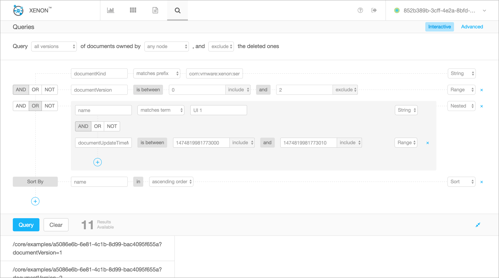

# Overview

The query  task service provides  a task-based  REST API to  specify and
execute rich  queries against  indexed documents, both  on the  node its
running, and across all nodes in  a specified node group. The service is
created through the service task factory (i.e., `/core/query-tasks`).

The  underlying  query engine  is  currently  powered by  LUCENE.  [This
tutorial](http://www.lucenetutorial.com/lucene-query-syntax.html)  gives
a good introduction  on the types of queries. We  also support all kinds
of  non string  queries  (e.g., numerical,  geospatial data  structures,
fuzzy searches)

Lucene uses MUST, MUST_NOT, SHOULD, and SHOULD_NOT as operators. [This blog post](https://lucidworks.com/blog/2011/12/28/why-not-and-or-and-not/) gives some good background on understanding those operators.

# REST API

## URI Path

```
/core/query-tasks
/core/query-tasks/<task-id>
/core/local-query-tasks
/core/local-query-tasks/<task-id>
```

The local query tasks are not load balanced and replicated across nodes.
They are  the appropriate  target for  broadcast requests,  allowing the
concurrent execution of independent queries on a per-node basis.


## Query Specification

The query task behavior is entirely driven by the [query task state](https://github.com/vmware/xenon/blob/master/xenon-common/src/main/java/com/vmware/xenon/services/common/QueryTask.java) and a set of properties that govern the result set:
```
public static class QuerySpecification {
        public enum QueryOption {
            /**
             * Query results are updated in real time, by using {@code QueryFilter} instance on the index.
             * Any update that satisfies the query filter will cause the results to be updated and a self
             * PATCH to be sent on the service.
             */
            CONTINUOUS,

            /**
             * Query results will return the number of documents that satisfy the query and populate the
             * the {@link results.documentCount} field. The results will not contain links or documents
             */
            COUNT,

            /**
             * The query will execute on the current view of the index, potentially missing recent updates.
             * This improves performance but does not guarantee latest results.
             */
            DO_NOT_REFRESH,

            /**
             * Query results will include the state documents in the {@link results.documents} collection
             */
            EXPAND_CONTENT,

            /**
             * Query results include the values for selected fields included in
             * {@link QuerySpecification#selectTerms}. The fields are then available through
             * the state documents in the {@link ServiceDocumentQueryResult#documents}
             * collection
             */
            EXPAND_SELECTED_FIELDS,

            /**
             * The query will execute over all document versions, not just the latest per self link. Each
             * document self link will be annotated with the version
             */
            INCLUDE_ALL_VERSIONS,

            /**
             * Query results will include document versions marked deleted
             */
            INCLUDE_DELETED,

            /**
             * Query results will be sorted by the specified sort field
             */
            SORT,

            /**
             * Infrastructure use only. Query originated from a query task service
             */
            TASK,

            /**
             * Broadcast the query to each node, using the local query task factory.
             * It then merges results from each node. See related option @{code QueryOption.OWNER_SELECTION}
             */
            BROADCAST,

            /**
             * Filters query results based on the document owner ID.
             * If the owner ID of the document does not match the ID of the host executing the query,
             * the document is removed from the result
             */
            OWNER_SELECTION,

            /**
             * Query results include the values for all fields marked with {@code PropertyUsageOption#LINK}
             */
            SELECT_LINKS,

            /**
             * Groups results using the {@link QuerySpecification#groupByTerms}
             */
            GROUP_BY

            /**
             * Query will return latest versions of documents before {@link QuerySpecification#timeSnapshotBoundaryMicros}
             */
            TIME_SNAPSHOT
        }

        public enum SortOrder {
            ASC, DESC
        }

        /*
         * Query definition
         */
        public Query query = new Query();

        ....
        ....
        ....

        /**
         * The optional resultLimit field is used to enable query results pagination. When
         * resultLimit is set, the query task will not return any results when finished, but will
         * include a nextPageLink field. A client can then issue a GET request on the nextPageLink
         * to get the first page of results. A nextPageLink field will be included in GET response
         * documents until all query results have been consumed.
         */
        public Integer resultLimit;

        /**
         * The optional expectedResultCount field will enable query retries until
         * expectedResultCount is met or the QueryTask expires. taskInfo.stage will remain in the
         * STARTED phase until such time.
         */
        public Long expectedResultCount;
        public EnumSet<QueryOption> options = EnumSet.noneOf(QueryOption.class);

        /**
         * Used with {@link QueryOption#TIME_SNAPSHOT}
         */
        @Since(ReleaseConstants.RELEASE_VERSION_1_3_6)
        public Long timeSnapshotBoundaryMicros;
}

```

## Continuous query tasks

The CONTINUOUS option  creates a long running query  filter that process
all updates to the local index. The query specification is compiled into
an efficient query  filter that evaluates the document  updates, and the
filter evaluates  to true,  the query  task is  PATCHed with  a document
results reflecting  the self link (and  document if EXPAND is  set) that
changed.

The  continuous  query  task  acts  as  a  node  wide  black  board,  or
notification   service  allowing   clients   or   services  to   receive
notifications  without having  to subscribe  to potentially  millions of
discrete services

## A Basic, Top-level Query

To create a new _query task_, one needs to send a POST (including a body
with a query  specification) to `/core/query-tasks`. Of  course, one can
use the per-service UI  available through `/core/query-tasks/ui` and cut
and paste from the template state and click POST.

As a  very simple  example, let's  query all  services that  include any
content in  the `message` field,  including all previous  versions (this
requires having option PERSISTENCE to `true`).

**TODO: Populate the document store**

```json
{
    "taskInfo": {
        "isDirect": true
    },
    "querySpec": {
        "options": [
            "INCLUDE_ALL_VERSIONS"
        ],
        "query": {
            "term": {
                "matchType": "WILDCARD",
                "matchValue": "*",
                "propertyName": "message"
            }
        }
    }
}
```

Setting `isDirect`  to `true` means that  the results will be  sent back
synchronously  --  this  is  easy for  interactive  experimentation  (we
discuss asynchronous  queries later). Instead  of wildcard, one  can use
TERM  (for  exact  matching)  or PHRASE  (for  proximity  matching)  for
matchType. In terms of options, one can use:

* EXPAND_CONTENT:  the query  results will  include the  entire document
description  in  addition  to   the  default  _documentLinks_  to  these
documents.
* EXPAND_SELECTED_FIELDS: the query results will include the selected
fields (specified by the selectTerms) from the document in addition to
the default _documentLinks_ to these documents.
* INCLUDE_DELETED: will  include the documents that  have either expired
or have been marked as deleted
* TASK: TODO
* COUNT: will return the total number of documents and no links to them
* INCLUDE_ALL_VERSIONS: will  include results  from a  version that  is
either created after the query was started, or, is the latest version
* SORT: will sort the results based on querySpec.sortOrder and
querySpec.sortTerm. More sort fields can be provided using `additionalSortTerms`
and `additionalGroupSortTerms`.
* TIME_SNAPSHOT: will return matching documents that are latest as of
provided querySpec.timeSnapshotBoundaryMicros.

In the Java Universe, this would be written as follows:

```java
        Query query = Query.Builder.createDirectTask()
                .addKindFieldClause(ExampleServiceState.class)
                .build();
        QueryTask queryTask = QueryTask.Builder.create()
                .addOption(QueryOption.EXPAND_CONTENT)
                .orderAscending(ExampleServiceState.FIELD_NAME_ID, TypeName.STRING)
                .setQuery(query).build();
        Operation post = Operation.createPost(queryFactoryURI)
                .setBody(queryTask)
                .setCompletion((o, e) -> {
                     // get results using `rsp.results.documentLinks`
                     QueryTask rsp = o.getBody(QueryTask.class);
                }
        sendRequest(post);
```


## Grouped Queries

The query task allows for grouping query results based on the discrete values of a given field.
Using the ExampleServiceState as an example, if you create N documents, and the name field is
set to the following values:
```
        URI exampleFactoryURI = UriUtils.buildUri(targetHost, ExampleService.FACTORY_LINK);
        String[] groupArray = new String[] { "one", "two", "three", "four" };
        for (String group : groups) {
            for (int i = 0; i < this.serviceCount; i++) {
                ExampleServiceState s = new ExampleServiceState();
                s.name = group;
                sendRequest(Operation.createPost(exampleFactoryURI)
                        .setBody(s));
            }
        }
```

Now, you can specify a query, that will group the example service instances, based on the "name" field, using
the following query:

```
        Query query = Query.Builder.create()
                .addKindFieldClause(ExampleServiceState.class)
                .build();
        QueryTask queryTask = QueryTask.Builder.create()
                .addOption(QueryOption.GROUP_BY)
                .addOption(QueryOption.EXPAND_CONTENT)
                .orderAscending(ExampleServiceState.FIELD_NAME_ID, TypeName.STRING)
                .groupOrder(ExampleServiceState.FIELD_NAME_NAME, TypeName.STRING, SortOrder.ASC)
                .setQuery(query).build();
```

The specification, plus results, in JSON:
```
  "taskInfo": {
    "stage": "FINISHED",
    "isDirect": false
  },
  "querySpec": {
    "query": {
      "occurance": "MUST_OCCUR",
      "booleanClauses": [
        {
          "occurance": "MUST_OCCUR",
          "term": {
            "propertyName": "documentKind",
            "matchValue": "com:vmware:xenon:services:common:ExampleService:ExampleServiceState",
            "matchType": "TERM"
          }
        }
      ]
    },
    "sortTerm": {
      "propertyName": "id",
      "propertyType": "STRING"
    },
    "groupSortTerm": {
      "propertyName": "name",
      "propertyType": "STRING"
    },
    "groupByTerm": {
      "propertyName": "name",
      "propertyType": "STRING"
    },
    "sortOrder": "ASC",
    "groupSortOrder": "ASC",
    "options": [
      "EXPAND_CONTENT",
      "SORT",
      "GROUP_BY"
    ]
  },
  "results": {
    "documentLinks": [],
    "nextPageLinksPerGroup": {
      "three": "/core/node-selectors/default/forwarding?peer=host-1&path=/core/query-page/1470166322490000&query=&target=PEER_ID",
      "two": "/core/node-selectors/default/forwarding?peer=host-1&path=/core/query-page/1470166322490005&query=&target=PEER_ID",
      "four": "/core/node-selectors/default/forwarding?peer=host-1&path=/core/query-page/1470166322486000&query=&target=PEER_ID",
      "one": "/core/node-selectors/default/forwarding?peer=host-1&path=/core/query-page/1470166322489003&query=&target=PEER_ID"
    },
    "documentVersion": 0,
    "documentUpdateTimeMicros": 0,
    "documentExpirationTimeMicros": 0
  },
```

A GET on each page link, returns a QueryTask, with results (documents, documentLinks) for the set of services in that group.

### Using Boolean Clauses

POST   body  that   will  attempt   to  find   a  service   instance  of
kind  `ExampleServiceState`  and  with  a  field  `name`  set  to  value
`query-target`.  This  is achieved  using  boolean  clause: we  match  a
particular  service kind,  as  well as  term content  (in  this case,  a
PHRASE).

```json
{
  "querySpec": {
    "query": {
      "booleanClauses": [
        {
          "term": {
            "matchValue": "com:vmware:xenon:services:common:ExampleService:ExampleServiceState",
            "propertyName": "documentKind"
          },
          "occurance": "MUST_OCCUR"
        },
        {
          "term": {
            "matchType": "PHRASE",
            "matchValue": "query-target",
            "propertyName": "name"
          },
          "occurance": "MUST_OCCUR"
        }
      ]
    }
  }
}
```

This  is  a booleanClause  query  (i.e.,  for  instance, not  a  simple,
top-level query).  `occurance` can be  MUST_OCCUR (equivalent of  AND --
default), MUST_NOT_OCCUR  (equivalent of NOT),  SHOULD_OCCUR (equivalent
of OR).

Note that we are not using isDirect this time (reminder: this defines if
your query  will return  results synchronously  or asynchronously  -- by
default the queries are _asynchronous_ and isDirect = false).

### Cloning an existing query task

A client can create a new instance of an existing query task, by sending
a  POST to  the query  task  factory, with  a simple  body, setting  the
documentSourceLink to  the path of  an existing query task.  The factory
will then get the state of the existing task and create a new query task
with it as  the initial state. This essentially re-creates  the task and
runs it.

## GET

Returns the contents of task. If the task is finished, or in progressed,
the result  collection will  be populated with  the document  links that
satisfied the query

A GET on the factory, returns all tasks.

On a specific task:
```sh
$ curl http://localhost:8000/core/query-tasks/2de69ad0-08a3-48fa-947a-f50b2e006806
```

```json
{
  "documentExpirationTimeMicros": 1413223137730000,
  "documentUpdateTimeMicros": 1413223107740000,
  "documentSelfLink": "/core/query-tasks/2de69ad0-08a3-48fa-947a-f50b2e006806",
  "documentKind": "com:vmware:xenon:services:common:QueryTask",
  "documentVersion": 2,
  "includeDeletedDocuments": false,
  "results": {
    "documentExpirationTimeMicros": 0,
    "documentUpdateTimeMicros": 0,
    "documentVersion": 0,
    "documents": null,
    "documentLinks": [
      "/core/examples/18a2f2eb-6cbb-4ae8-9c15-2cb75d84608b"
    ]
  },
  "querySpec": {
    "query": {
      "booleanClauses": [
        {
          "term": {
            "matchValue": "com:vmware:xenon:services:common:ExampleService:ExampleServiceState",
            "propertyName": "documentKind"
          },
          "occurance": "MUST_OCCUR"
        },
        {
          "term": {
            "matchType": "PHRASE",
            "matchValue": "query-target",
            "propertyName": "name"
          },
          "occurance": "MUST_OCCUR"
        }
      ],
      "occurance": "MUST_OCCUR"
    }
  },
  "taskInfo": {
    "isDirect": false,
    "stage": "FINISHED"
  }
}
```

# Query Examples

## Boolean Query

### Simple Query
```json
{
  "querySpec": {
    "query": {
      "booleanClauses": [
        {
          "term": {
            "matchValue": "com:vmware:xenon:services:common:QueryValidationTestService:QueryValidationServiceState",
            "propertyName": "documentKind"
          },
          "occurance": "MUST_OCCUR"
        },
        {
          "term": {
            "matchType": "TERM",
            "matchValue": "decentralized",
            "propertyName": "stringValue"
          },
          "occurance": "MUST_OCCUR"
        }
      ]
    }
  }
}
```

### Nested Query
```json
{
  "querySpec": {
    "query": {
      "booleanClauses": [
        {
          "booleanClauses": [
            {
              "term": {
                "matchValue": "com:vmware:xenon:services:common:QueryValidationTestService:QueryValidationServiceState",
                "propertyName": "documentKind"
              },
              "occurance": "MUST_OCCUR"
            },
            {
              "term": {
                "matchType": "TERM",
                "matchValue": "decentralized",
                "propertyName": "stringValue"
              },
              "occurance": "MUST_OCCUR"
            }
          ]
        },
        {
          "booleanClauses": [
            {
              "term": {
                "matchValue": "com:vmware:xenon:services:common:QueryValidationTestService:QueryValidationServiceState",
                "propertyName": "documentKind"
              },
              "occurance": "MUST_OCCUR"
            },
            {
              "term": {
                "range": {
                  "precisionStep": "4",
                  "isMaxInclusive": "false",
                  "isMinInclusive": "false",
                  "max": 123.21,
                  "min": 123.2,
                  "type": "DOUBLE"
                },
                "matchType": "TERM",
                "propertyName": "doubleValue"
              },
              "occurance": "MUST_OCCUR"
            }
          ]
        }
      ]
    }
  }
}
```

### Numeric Range Query
```json
{
    "querySpec": {
        "query": {
            "occurance": "MUST_OCCUR",
            "term": {
                "propertyName": "longValue",
                "range": {
                    "type": "LONG",
                    "min": 10.0,
                    "max": 990.0,
                    "isMinInclusive": "false",
                    "isMaxInclusive": "false",
                    "precisionStep": "2147483647"
                }
            }
        }
    }
}
```


```json
{
    "querySpec": {
        "query": {
            "occurance": "MUST_OCCUR",
            "term": {
                "propertyName": "doubleValue",
                "range": {
                    "type": "DOUBLE",
                    "min": 123.0,
                    "max": 173.0,
                    "isMinInclusive": "true",
                    "isMaxInclusive": "false",
                    "precisionStep": "2147483647"
                }
            }
        }
    }
}
```
## Sorting Results
The following query sorts the documents of kind ExampleServiceState based on the property `name`.
`sortOrder` specifies ASC/DESC order. The `EXPAND_SELECTED_FIELDS` option is used to select just
the 'name' field in the returned documents.
```json
{
    "taskInfo": {
        "isDirect": true
    },
    "querySpec": {
        "options": [
            "SORT", "EXPAND_SELECTED_FIELDS"
        ],
        "sortTerm" : {
                "propertyType": "STRING",
                "propertyName": "name"
            },
        "sortOrder" : "DESC",
        "selectTerms" : [ {
                "propertyType": "STRING",
                "propertyName": "name"
            }],
        "query": {
            "term": {
                "matchType": "TERM",
                "matchValue": "com:vmware:xenon:services:common:ExampleService:ExampleServiceState",
                "propertyName": "documentKind"
            }
        }
    }
}
```
note: In order for a property to be enabled for sorting, it must have indexingOption `SORT` enabled.
please see the [programming model page](./Programming-Model) and
[example service page](./Example-Service-Tutorial) for more information.

### Sorting using multiple fields.
The following query sorts the documents of kind ExampleServiceState based on the property `sortedCounter`
in DESC order and then based on the property `name` in ASC order.

Use `additionalSortTerms` or  `additionalGroupSortTerms` as appropriate to represent additional fields.

```json
{
    "taskInfo":{
        "isDirect":true
    },
    "querySpec":{
        "query":{
            "occurance":"MUST_OCCUR",
            "booleanClauses":[
                {
                    "occurance":"MUST_OCCUR",
                    "term":{
                        "propertyName":"documentKind",
                        "matchValue":"com:vmware:xenon:services:common:ExampleService:ExampleServiceState",
                        "matchType":"TERM"
                    }
                }
            ]
        },
        "sortTerm":{
            "propertyName":"sortedCounter",
            "propertyType":"LONG"
        },
        "additionalSortTerms":[
            {
                "propertyName":"name",
                "propertyType":"STRING",
                "sortOrder":"ASC"
            }
        ],
        "sortOrder":"DESC",
        "options":[
            "SORT"
        ]
    },
    "indexLink":"/core/document-index"
}
```

note: When either of `sortTerm` and `groupSortTerm` is not provided, the additional
sort fields are ignored. The `sortOrder` for the additional fields should be provided
along with the `propertyName` and `propertyType`.

## Performing a snapshot query
If a document with link `/core/examples/1234` has multiple versions 0
at time `t0`, 1 at `t1` and 2 at `t2`. When QueryOption#TIME_SNAPSHOT
is set and QuerySpecification#timeSnapshotBoundaryMicros is set to
`t1 + ∆` the response will include only version `1` of the document.

## OData queries

The document index can also be queried using a subset of the [OData](http://www.odata.org/documentation/odata-version-2-0/uri-conventions/#4.5) specification.  This is to aid in querying interactively without the use of tools like `xenonc` to form `querySpec` documents.  

To use OData `$select` and `$filter` based queries, issue a `GET` on `/core/odata-queries` with the appropriate OData query parameters.  This will result in a direct query task with equivalent an `querySpec`.  The `DIRECT` query has the `EXPAND` option so results will be embedded in the results.

#### OData select

The OData `$select` syntax is: `$select=<comma-separated-fieldname-list>`. Use of the `$select` query parameter will cause only the selected fields to be returned in the expanded results, rather than the default of the full document contents.

#### OData filter verbs

The `odata-queries` service supports only a subset of the OData URI specification.  The following are the only currently supported `$filter` query verbs.

| Operator | Description | Example |
| -------- | ------------| ------- |
| Logical Operators | | |
| eq | Equal | documentSelfLink eq /core/examples/a703f44a-ab33-4451-87b2-6554160ed1e0 |
| ne | Not equal | name ne 'London' |
| gt | Greater than | counter gt 20 |
| ge | Greater than or equal | counter ge 10 |
| lt | Less than | price lt 20 |
| le | Less than or equal | price le 100 |
| and | Logical and | Price le 200 and Price gt 3.5 |
| or |Logical or | name eq instance-1 or counter gt 200 |
| any | Any of | name any 'instance-1;instance-2' |
| all | All of | tags.item all 'tag1;tag2' |
| Grouping Operators | | |
| ( ) | Precedence grouping | (counter gt 200 and counter lt 100) or name eq instance-150 |


#### OData $filter Example

*Query for all documents with the property name `name` has the value `instance-1`.*
```
$ http "http://localhost:8000/core/odata-queries?\$filter(name eq instance-1)"
HTTP/1.1 200 OK

{
 ...
    "indexLink": "/core/document-index",
    "querySpec": {
        "options": [
            "EXPAND_CONTENT"
        ],
        "query": {
            "occurance": "MUST_OCCUR",
            "term": {
                "matchType": "TERM",
                "matchValue": "instance-1",
                "propertyName": "name"
            }
        },
        "resultLimit": 2147483647
    },
    "results": {
...
        "documentLinks": [
            "/core/examples/a703f44a-ab33-4451-87b2-6554160ed1e0"
        ],
...
        "documents": {
            "/core/examples/a703f44a-ab33-4451-87b2-6554160ed1e0": {
...
        },
    },
    "taskInfo": {
        "isDirect": true,
        "stage": "FINISHED"
    }
}
```
#### OData query parameters on Factory Services

In addition to `/core/odata-queries`, OData query parameters can be applied on all
factory services. Factory service adds an implicit booleanClause to match
the field `documentKind` with the child service document type.

For example `/core/examples?$filter=name eq ABC` implicitly adds a booleanClause
matching `documentKind` to `ExampleServiceState`.

The filter on Factory services has an additional wildcard property name called `ALL_FIELDS`. It is a convenient way to unfold a query to search all indexed fields of document and their sub-fields nested up to 2 levels, excluding the build-in ServiceDocument fields.

For example `/core/examples?$ALL_FIELDS eq ABC` will return all `ExampleServiceState` documents that match `ABC` in their `name`, any item of `tags`, any key or value of `keyValues` or any other indexed field of this document (excluding the fields of ServiceDocument). If the `ExampleServiceState` contained another complex object, it's properties would also be unfolded.
Supported operators for a `ALL_FIELDS` query are `eq`, `ne`, `all` and `any`. It can be used in addition with other queries as any other query.

#### OData $filter for complex queries

Following examples demonstrate supported combinations with $filter.
We assume they are run on '/core/examples'.

* All of ( A B C )

`tags.item all 'tag1;tag2'`

This translates to `tags.item eq tag1 and tags.item eq tag2`

Note that Xenon stores collections such as Arrays, Lists and Sets with a special postfix ".item".
If the service document has `Set<String> tags`, use `tags.item`.

* Any of ( A B C )

`name any 'ABC;XYZ'`

This translates to `name eq ABC or name eq XYZ`

* A and Not B

`name eq ABC and counter ne 20`

* A and ( B or C )

`name eq ABC and ( counter eq 10 or counter eq 20 )`

* A or ( B and C )

`name eq ABC or ( counter eq 10 and keyValues.myKey eq 'myValue' )`

* Not A and Not B

Works with a factory, not directly on OData query service.

`name ne ABC and name ne XYZ`

* Not A or Not B

Works with a factory, not directly on OData query service.

`name ne ABC or counter ne 20`

* A or Not B

This combination is not supported directly. Instead use "A or (C Not B)"

Use `name eq TEST1 or (name eq TEST* and keyValues.myKey ne myValue)`
when trying to achieve `name eq TEST1 or keyValues.myKey ne myValue`

When combining any NOT sub-clause with OR, the same applies.
Even in case of combining Not A and Not B , Not A or Not B
use it in a combination with AND.

For example
* Use A and (Not B and Not C)
* Use A and (Not B or Not C)   

They work on Factory service as mentioned above because the `documentKind` clause is added implicitly.

Xenon uses Lucene to index and store documents, and it does not support the combination ( A or Not B).       
### Using Pagination

The `resultLimit` field  is used to enable query  results pagination. By
default  a query  will return  all results  in a  single document.  When
`resultLimit` is  set, the query task  will not return any  results when
finished, but  will include  a `nextPageLink` field.  A client  can then
issue a  GET request on  the `nextPageLink` to  get the first  page of
results.  

### Document Kinds

The   `documentKind`  is   the   same  as   when   creating  the   task:
`com:vmware:xenon:services:common:QueryTask`.  In   the  case  of   a  GET
response, the `taskInfo.stage` will either  be FINISHED or FAILED, there
is  no  need to  poll  even  if  `isDirect`  was `false`  when  creating
the  query  task.  A  `nextPageLink`  field  will  be  included  in  GET
response  documents until  all  query results  have  been consumed.  The
`nextPageLink`  services  inherit  the original  `querySpec`,  including
`documentExpirationTimeMicros`. The `documentCount` field will be set to
the total  number of hits and  the `prevPageLink` field will  be set for
navigating to the previous page of results.

For the example, first create a set of example documents:

```sh
$ for i in {1..2000}; do xenonc post /core/examples --name "doc-${i}"; done
```

Next, create a query task with `resultLimit` set to 100:

```sh
$ xenonc <<EOF
action: post

path: /core/query-tasks

body:
  taskInfo:
    isDirect: true
  querySpec:
    resultLimit: 100
    options:
       - EXPAND_CONTENT
    query:
      occurance: MUST_OCCUR
      booleanClauses:
        - occurance: MUST_OCCUR
          term:
            propertyName: documentKind
            matchValue: com:vmware:xenon:services:common:ExampleService:ExampleServiceState
        - occurance: MUST_OCCUR
          term:
            propertyName: name
            matchValue: 'doc-*'
            matchType: WILDCARD
EOF
```

The response  will have zero  `documentLinks` and `nextPageLink`  set to
the URI of the first page:

```json
{
  "taskInfo": {
    "stage": "FINISHED",
    "isDirect": true
  },
  "querySpec": {
    "query": {
      "occurance": "MUST_OCCUR",
      "booleanClauses": [
        {
          "occurance": "MUST_OCCUR",
          "term": {
            "propertyName": "documentKind",
            "matchValue": "com:vmware:xenon:services:common:ExampleService:ExampleServiceState",
            "matchType": "TERM"
          }
        },
        {
          "occurance": "MUST_OCCUR",
          "term": {
            "propertyName": "name",
            "matchValue": "doc-*",
            "matchType": "WILDCARD"
          }
        }
      ]
    },
    "resultLimit": 100,
    "options": [
      "EXPAND_CONTENT"
    ]
  },
  "results": {
    "documentLinks": [],
    "nextPageLink": "/277da2e8-f2e4-4ad5-9a8a-ae173f47d853",
    "documentVersion": 0,
    "documentUpdateTimeMicros": 0,
    "documentExpirationTimeMicros": 0,
    "documentOwner": "168c9af7-193d-4b6c-92c5-409df5b27752"
  },
  "indexLink": "/core/document-index",
  "documentVersion": 0,
  "documentEpoch": 0,
  "documentKind": "com:vmware:xenon:services:common:QueryTask",
  "documentSelfLink": "/core/query-tasks/166cd49e-05d8-4e81-ac86-dbca73cc5ad4",
  "documentUpdateTimeMicros": 1432747351265007,
  "documentExpirationTimeMicros": 1432747951265019,
  "documentOwner": "168c9af7-193d-4b6c-92c5-409df5b27752"
}
```

To see the first page of query results, send a GET request to the `nextPageLink`:

```sh
$ xenonc get /277da2e8-f2e4-4ad5-9a8a-ae173f47d853
```

The response will have 100 *documentLinks* and *nextPageLink* set to the URI of the second page:

```json
{
  "taskInfo": {
    "stage": "FINISHED",
    "isDirect": true
  },
  "querySpec": {
    "query": {
      "occurance": "MUST_OCCUR"
    },
    "resultLimit": 100,
    "options": [
      "EXPAND_CONTENT"
    ]
  },
  "results": {
    "documentLinks": [
      "/core/examples/a67c4d98-793b-4cd6-b77b-6bc657e228fa",
      "/core/examples/001fcebe-d669-49a8-9685-88b5c3b644cf",
      "..."
    ],
    "documents": {
      "/core/examples/a67c4d98-793b-4cd6-b77b-6bc657e228fa": {
        "keyValues": {},
        "name": "doc-13",
        "documentVersion": 0,
        "documentEpoch": 0,
        "documentKind": "com:vmware:xenon:services:common:ExampleService:ExampleServiceState",
        "documentSelfLink": "/core/examples/a67c4d98-793b-4cd6-b77b-6bc657e228fa",
        "documentSignature": "5e522c487980b647896b6502d8dcaef21e3b6c92",
        "documentUpdateTimeMicros": 1432746726377012,
        "documentExpirationTimeMicros": 0,
        "documentOwner": "168c9af7-193d-4b6c-92c5-409df5b27752"
      },
      "/core/examples/001fcebe-d669-49a8-9685-88b5c3b644cf": {
        "keyValues": {},
        "name": "doc-69",
        "documentVersion": 0,
        "documentEpoch": 0,
        "documentKind": "com:vmware:xenon:services:common:ExampleService:ExampleServiceState",
        "documentSelfLink": "/core/examples/001fcebe-d669-49a8-9685-88b5c3b644cf",
        "documentSignature": "f62ca3a6baadddf8ee0d05c8aaac142f51b2ae33",
        "documentUpdateTimeMicros": 1432746727319012,
        "documentExpirationTimeMicros": 0,
        "documentOwner": "168c9af7-193d-4b6c-92c5-409df5b27752"
      },
      "...": {
        "...": "..."
      }
    },
    "nextPageLink": "/6cd352b5-c5f2-4321-aaf0-1a8d14db6af2",
    "documentVersion": 0,
    "documentUpdateTimeMicros": 0,
    "documentExpirationTimeMicros": 0,
    "documentOwner": "168c9af7-193d-4b6c-92c5-409df5b27752"
  },
  "indexLink": "/core/document-index",
  "documentVersion": 0,
  "documentKind": "com:vmware:xenon:services:common:QueryTask",
  "documentSelfLink": "/277da2e8-f2e4-4ad5-9a8a-ae173f47d853",
  "documentUpdateTimeMicros": 0,
  "documentExpirationTimeMicros": 1432748187234995
}
```

The following example will *GET* the given link, save the results to a file and follow *nextPagelink* if set.
First, paste this function into a bash shell:

```sh
$ function getQueryPages() {
  set -e
  link=$1

  nextLink=$(xenonc get $link | jq -r .results | tee $(basename $link).json | jq -r .nextPageLink)

  if [ "$nextLink" != "null" ]; then
    getQueryPages $nextLink
  fi
}
```

Example run:

```sh
$ getQueryPages /277da2e8-f2e4-4ad5-9a8a-ae173f47d853

$ ls -1 *.json
0d5e0c18-fa38-4ccb-9910-75d19e25e87a.json
0e71afb5-8166-423b-822d-e70d6354721f.json
108f66a1-3fb8-40fe-905e-204fa36afec3.json
...

% jq .documentLinks[] < 0d5e0c18-fa38-4ccb-9910-75d19e25e87a.json | wc -l
100
```


## Other examples

### Processing homogeneus query results.

When querying a factory or using a QueryTask that filter on the documentKind the resulting list contains
service documents of the same kind. To process such results with a minimal amount of code you can use `QueryResultsProcessor` class. It
offers the same view over a `QueryTask`, `ServiceDocumentQueryResults` results and even an `Operation` whose body is either of those types:

```java
QueryTask task = ...
Operation op = Operation.createPost(...)
    .setBody(task)
    .setCompletion((o, e) -> {
      if (e != null) {
        handleError(e);
        return;
      }

      // let the processor convert the body from the operation
      QueryResultsProcessor processor = QueryResultsProcessor.create(o);

      // processor will convert every result to desired type if needed
      for(MyDocumentType doc: processor.documents(MyDocumentType.class)) {
        // linked documents will also be converted to the desired type
        OtherDocumentType linked = processor.linkedDocument(doc.someLink, OtherDocumentType.class);

        handleDocuments(doc, linked);
      }
    });

```
