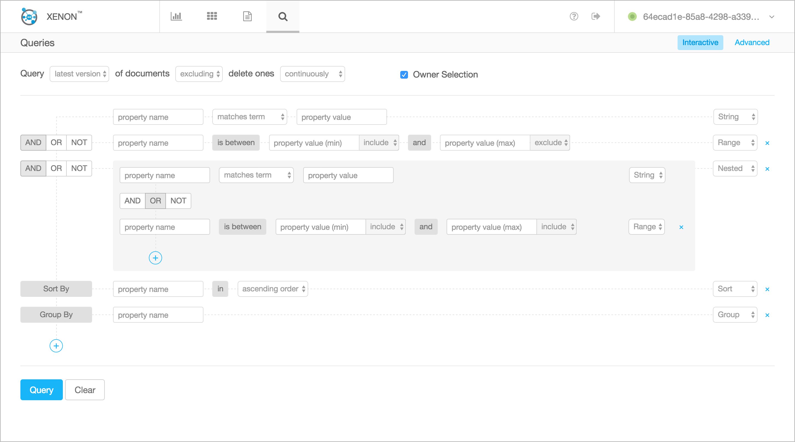
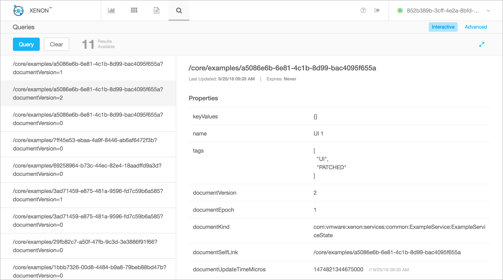

# Overview
Xenon provides a built-in application which federates information from nodes across the node groups and visualize them in a single pane of UI. It also offers a rich set of features that can help you:
- Navigate to any node within the node groups and browse node-specific document contents.
- Add/Edit/Delete instances with test payloads.
- Generate query tasks interactively.
- (WIP) Trace operations.
- Extract logs that are specific to each node.

## Availability
Xenon UI comes with every Xenon jar after 0.9.6 and is available in [http://localhost:8000/core/ui/default](http://localhost:8000/core/ui/default).

**Note** It is still in its early stage of development and is expected to iterate/change rapidly.

# Features

## Node Selector
Displays all the peer nodes and their system info in the current group, and you can select a specific node so the UI shows all the information relevant to this node.

## Dashboard
Shows stats for CPU, Memory and Disk usage, and logs.

## Services
Lists all the available factory services with their status and options.

Under each factory service comes detailed information and stats of the service instances.

You can also easily Create, Edit(PATCH/PUT) and Delete instances from the UI.

## Logs
Since logs are specific to each node, the UI provides an easy way to browse the logs on different nodes.

## Queries
Interactive query builder for generating simple queries (up to one level of nested boolean clauses).

If you are really savvy with the queries, try out the "Advanced" query.

Query results will be displayed on the same page for further review.

# Documentation
Refer to [Xenon UI Readme](https://github.com/vmware/xenon/blob/master/xenon-ui/src/main/ui/README.md)

# Build Your Own UI?
Refer to [Host Your UI](./Host-Your-UI)
